# Cloud concepts

## What is Cloud Computing

The practice of using a network of remote servers hosted on the internet to store, mange and process data, rather than a local server or personal computer. Its the on demand delivery of compute, database storage, applications and other IT resources through cloud services platform via the internet with pay-as-you-go pricing.
## On Premise vs Cloud Providers

On-Premise:

- You own the servers
- You hire the IT people
- You pay or rent the real-state
- You take all the risk

Could Providers:

- Someone else own the servers
- Someone else hires the IT people
- Someone else pays or rents the real state
- You are responsible for your configuring cloud services and code, someone else take care of the rest

## Six advantages and benefits

- Trade capital expense for variable expense. No upfront-cost istead of paying for data centers and servers Pay On-Demand only when you consume computing resources.
- Benefit from massive economies of scale. You're never going to have the same purchasing power as Amazon in a non cloud environment. You will be sharing the cost with other customers to get unbeatable savings.
- Stop guessing capacity. Eliminate guesswork about infraestructure capacity needs. Instead of paying for iddle or underutilized servers, you can scale up or down to meet the current need. cloud can scale with your business needs with no long term contracts.
- Increase speed and agility. Launch resources within a few clicks in minutes istead of waiting days or weeks of your IT to implement the solution on-premise.
- Stop spending money on running and maintaining data centers. Focus on your own customers, rather than in the heavy lifting of racking, stacking, and powering servers.
- Go global in minutes. Deploy your app in multiple regions arround the world in a few clicks. Provide lower latency and a better experience for your customers at minimal cost.

## Types of Cloud Computing

- SaaS (For Customers) Software as a service. A completed product that is run and manged by the service provider.
- PaaS (For Developers) Platform as a service. Removes the need for your organization to manage the underlying infraestructure. Focus on the deployment and management of your applications. Somone else manages the underlying hardware and operating systems.
- IaaS (For Admins) Infraestructure as a service. The basic building blocks for cloud IT. Provides access to networking features, computers and data storage space. You manage the server which can be phisycal or virtual, as well as the operating system.
- FaaS Function as a service. It is a category of cloud computing services that provides a platform allowing customers to develop, run, and manage application functionalities without the complexity of building and maintaining the infrastructure typically associated with developing and launching an app.

## Cloud Computing Deployment Models

- Public Cloud. Fully utilizing cloud computing. Designed for startups, SaaS offerings, new proyects and companies.
- Hybrid. Using both Public Cloud and on premise. For banks, fintech, Ivest management, large professional Service providers, legacy On-Pemise.
- On-Premise / Private cloud. Deploying resources on-premise, using virtualization and resource management tools, is sometimes called private cloud. Public sector, super sensitive data, large enterprise with heavy regulation.

## Key services for GCP exam?

AWS Global Infraestructure, Compute (EC2, Lambda), Storage (SSS, Glacier), Databases (RDS, DynamoDB), Migration & Transfer, Network & Content Delivery (VPC, Route53), Security & Identity & Compliance, AWS Cost management.

## Global Services
- IAM
- Route53
- CloudFront CDN
- SNS
- SES
## On Premise Services
- Snowball
- Snowball Edge
- Storage Gateway
- CodeDeploy. A way to deploy your code to EC2 instances and on premise servers as well.
- Opsworks. Automated deployments using Chef and Puppet. Chef and Puppet are automation platforms that allow you to use code to automate the configurations of your servers.
- IoT Greengrass. Connect your IoT devicesup to the AWS Cloud and on premise service as well.
# AWS Global Infraestructure

80 Avilability Zones within 25 Geographic Regions arround the world. Way More Edge Locations than AZs.

AWS server over a million active customers in more than 190 countries. Steadily global infreastructure to help customers achieve lower latency and higher throughput.

Regions are a physical location in the world with multiple Availability Zones. Thats to say, a geographical area that consists of 2 or more AZs.

Availability Zones are one or more discrete data centers.

Edge locations are datacenters owned by a trusted partner of AWS. These are endpoints for AWS which are used for caching content. Typically this consists of CloudFront (Amazon Content Delivery Network). There are over 150 Edge Locations.

## Regions

A geographically distinct location wich has multiple dastacenters (AZs). Every region is independent of every other region in termns of location, power, water supply. Easch region has at least two AZs and the largest region is US-EAST.

New services almost always become available fist in US-EAST. Not all services are available in all regions. US-EAST-1 is the resion where you see all your billing infotmation.

## Availability Zones

An AZ is a datacenter owned and operated by AWS in which AWS services run. Each region has at least two AZs. AZs are represented by a region code, followed by a letter identifier.

Multi-AZ: Distributing your instances across multiple AZs allows failover configuration for handling requests when one goes down (<10ms latency between AZs)

## Edge Locations

An Edege Location is a datacenter owned by a trusted partner of AWS which has a direct connection to AWS network. These locations server requests for CloudFront and route53. Requests going to either of these service will be routed to the nearest edge location automatically.

S3 Transfer Acceleration traffic and API Gateway endpoint traffic also use the AWS Edge Network. This allows for low latency no matter where the end user is geographically located.

## GovCloud Regions

AWS GovCloud Regions alllow customers to host sensitive Controlled Unclasssified Information and other types of regulated workloads. GovCloud Regiond are only operated by employees who are U.S. citizens, on U.S. soil. They are only accesible to U.S. entities and root account holders who pass a screening process. Customers can architect secure solutions that comply with:

- FedRAMP High Baseline
- DOJ`s Criminal Justice Information Systems (CJIS) Security Policy
- U.S. International Traffic in Arms Regulations (ITAR)
- Export Administrtion Regulations (EAR)
- Department of Defense (DoD) Cloud Computing Security Requeriments Guide

# AWS Access ways

- Via the Console.
- Programatically (Command Line).
- Using the Software Developer Kit.

# Identity Access Management (IAM)

IAM allows you to create users, groups, roles and basically its a way to give access to AWS to your different users and groups. It is global, you fo not specify a region when dealing with IAM. When you create a user or group, this is created GLOBALLY.

You can generate and download a credential report that lists all users in your account.  

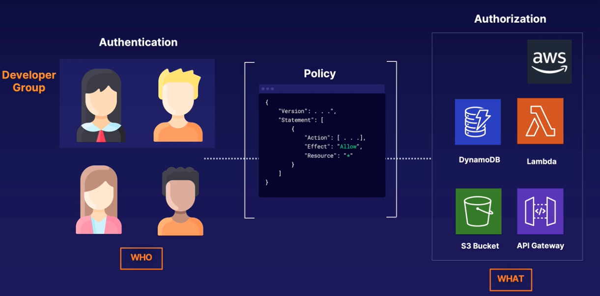  

When compromised IAM credentials are found these are the steps to follow:
- Determine what resources those credentials have access to.
- Invalidate the credentials so they can no longer be used to access your account.
- Consider invalidating any temporary security credentials that might have been issued using the credentials.
- Restore appropiate access to that user.
- Review access to your AWS account.

[Security best practices in IAM](https://docs.aws.amazon.com/IAM/latest/UserGuide/best-practices.html):  
- Lock away your AWS account root user access keys
- Create individual IAM users
- Use user groups to assign permissions to IAM users
- Grant least privilege
- Get started using permissions with AWS managed policies
- Validate your policies
- Use customer managed policies instead of inline policies
- Use access levels to review IAM permissions
- Configure a strong password policy for your users
- Enable MFA
- Use roles for applications that run on Amazon EC2 instances
- Use roles to delegate permissions
- Do not share access keys
- Rotate credentials regularly
- Remove unnecessary credentials
- Use policy conditions for extra security
- Monitor activity in your AWS account

IAM entities are the users (IAM users and federated users) and roles that are created and used for authentication. A Principal is a person or application that uses the AWS account root user, an IAM user, or an IAM role to sign in and make requests to AWS.
# EC2 Pricing Models

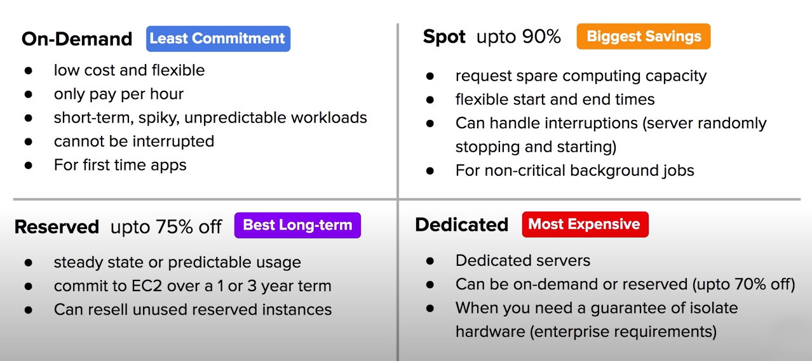

## On-Demand

When you launch an EC2 instance it is by default using On-demand pricing. On-demand has no up-front payment and no long term commitment. You are charged by the hour or by the minute (varies based on EC2 instace types)

On-demand is for applications where the workloads is for short-term, spikey or unpredictible. When you have a new app for development or you want to run experiment.

## Reserved Instances

Designed for applications that have a steady-state, predictable usage, or requie reserved capacity. RIs can be shared between multiple accounts within an org. Unused RIs can be sold in the Reserved Instance Marketplace.

> Reduced pricing is based on Term x Class Offering x Payment Option.

### Class

- Standard: Up to 75% reduced pricing compared to on-demand. Cannot change RI attributes.
- Convertible: Up to 54% reduced pricing compared to on demand. Allows you to change RI attributes if greater or equal in value.
- Scheduled: You reserve instances for specific time periods. Savings vary.

### Terms

You commit to a 1 year or 3 year contract. The longer the term the greater savings.

### Payment options

All upfront, Partial Upfront and No Upfront. The greater upfront the great the savings.

## Spot Instances

AWS has unused capacity that they want to maximize the utility of their iddle servers. Spot instances provide a discount of 90% compared to On-demand pricing. Spot Instances can be terminated if the computing capacity is needed by on-demand customers.

### Termination conditions

Instances can be terminated by AWS at anytime. If your instance is terminated by AWS, you do not get charged for a partial hour of usage. If you terminate an instance you will still be charged for any hour that it ran.

## Dedicated Host Intances

Designed to meet regulatory requirements. When you have strict server-bound licensing that will not support multi-tenancy or cloud deployments.

> Multi-Tenant: When multiple customers are running workloads on the same hardware (Virtual Isolation). Single-Tenant: When a single customer has dedicated harware (Physical Isolation)

Offered in both On-Demand and Reserved (70% on-demand pricing). Enterprise and Large Organizations may have security concerns or obligations about against sharing the same hardware with other AWS customers.

## EC2 Instance types
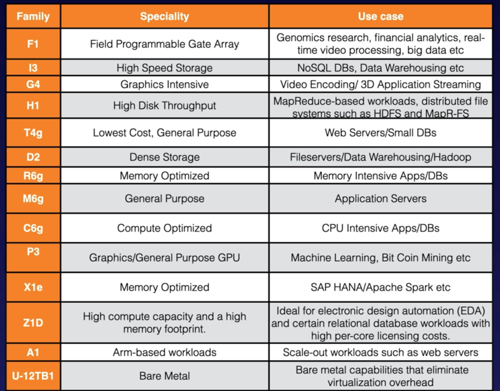

There is some mnemonic rules to learn all this types:
- F => FPGA
- I => IOPS
- G => Graphics
- H => Hish Disk Throughput
- T => Cheap general purpose
- D => Density Storage
- R => RAM Optimised
- M => Main choice for general purpose apps
- C => Compute
- P => Graphics
- X => Extreme Memory
- Z => Extreme Memory and CPU
- A => ARM based
- U => Bare Metal

## AWS Systems Manager
When you have multiple EC2 instances (EC2 Fleet) you can install a piece of software on each instance that connects to Systems Manager and can run a command across all these instances at once. It can be installed in your on-premise servers too. Run command can be used to install, patch and unistall software. It integrates with cloudwatch to give you a dashboard of your entire state.

## Service Health Dashboard
Shows all regions and the health of all AWS services in those regions. You can review all historical information for each AWS service on a per-day basis. Also you can subscribe to RSS feeds and get immediate notifications if a specific service in a particular region goes down.

## Personal Health Dashboard
The personalized health dashboard offers an overview of the AWS services you actually use and whether or not they are having any availabiliy issues. The dashboard displays up-to-date information on the status of your AWS services and provides proactive notifications as to any scheduled activities.

## Global Accelerator
Is a service in which you create accelerators to improve availability and performance of your applications for local and global users. Also you can direct traffic to optimal endpoints over the AWS global network, which improves the availability and perfomance of your internet applications that are used by a global audience.
It works sending your user's traffic through AWS global network infraestructure, improving your internet user performance by up to 60%. When the internet is congested, Global Accelerator's automatic routing optimizations will help keep your packet loss, jitter and latency consistently low.
# Billing and Pricing

## Capex vs Opex
- Capex stands for Capital Expenditure which where you pay up front. It's a fixed, sunk cost.  
- Opex stands for Operational Expenditure which is where you pay for what you use. Think of Utulity billing such as electricity, gas, water, etc.

## Basic Pricing Policies
- Pay as you go
- Pay less when you reserve
- Pay even less per unit by using more
- Pay less as AWS grows
- Custom pricing
## Fundamental drivers of cost
- Compute
- Storage
- Data outbound
## Free Services

Totally Free: IAM - Identity Access Management, Amazon VPC, Organizations and Consolidated Billing
Can incur on costs: Auto Scaling, CloudFormation, Elastic Beanstalk, Opsworks, Amplify, AppSync, CodeStar
## EC2 Pricing
What determines EC2 pricing is Clock Hours of Server Time, Instance Type, Pricing Model, Number of instances, Load Balancing, Detailed Monitoring, Auto Scalling, Elastic IP Addresses, Operating Systems and Software Packages.
## Lambda Pricing
You pay for each request as it is serverless (Free Tier: 1 Million/Month, 0.20 per 1 million requests thereafter), Duration pricing (400000 GB-seconds per month up to 3.2 million seconds of compute time, 0.00001667 for every GB-second thereafter), Aditional Charges (if your lambda function users other AWS services).
## EBS Pricing
Volumes (per GB), Snapshots (per GB), Data Transfer.
## S3 Pricing
Storage Class, Storage, Requests (GET, PUT, COPY), Data Transfer
## Glacier Pricing
Storage, Data Retrieval Times
## Snowball Pricing
Service fee per job (50 TB 200$, 80 TB 250$), Daily Charge (First 10 days free, then 15$ a day), Data Transfer (Into S3 is free).
## RDS Pricing
Clock Hours of Server Time, Database Characteristics, Database Purchase Type, Number of Database Instances, Provisioned Storage, Aditional Storage, Requests, Deployment Type, Data Transfer. When you use Amazon RDS, you can choose to use on-demand DB instances or reserved DB instances.
## Cloudfront Pricing
Traffic Distribution, Requests, Data Transfer Out.
## AWS Support Plans

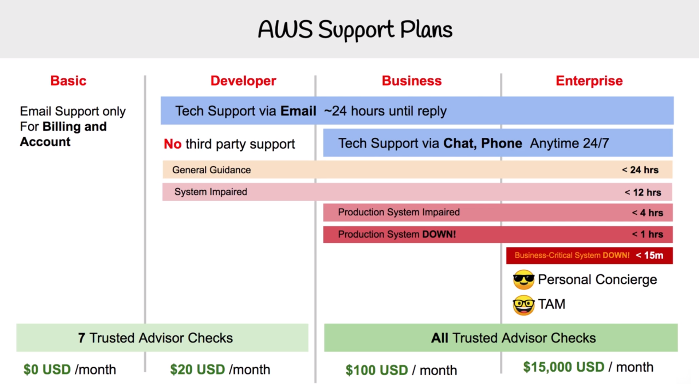
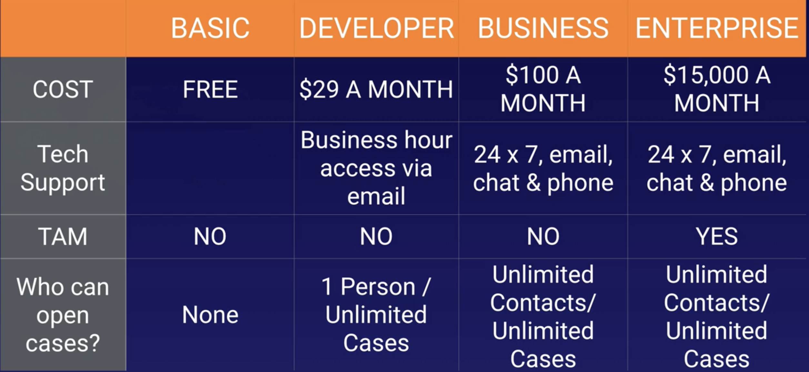
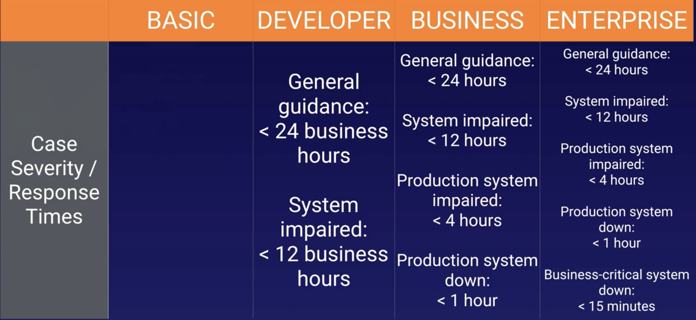
[Support Plans](https://aws.amazon.com/premiumsupport/plans/)  
AWS Infrastructure Event Management (IEM) offers architecture and scaling guidance and operational support during the preparation and execution of planned events, such as shopping holidays, product launches, and migrations. For these events, AWS Infrastructure Event Management will help you assess operational readiness, identify and mitigate risks, and execute your event confidently with AWS experts by your side. The program is included in the Enterprise Support plan and is available to Business Support customers for an additional fee.

## AWS Marketplace

AWS Marketplace is acurated digital catalogue with thousands og software listings from independent software vendors. Easily find, buy, test and deploy software that already runs on AWS.

The product can be free to use or can have an associated charge. The charge becomes part of your AWS bill, and once you pay, AWS MArketplace pays the provider.

The sales channel for ISVs and Consulting Partners allows you to sell your solutions to other AWS customers.

Products can be offered as:

- Amazon Machine Images (AMIs)
- AWS CloudFormation templates
- Software as a service (SaaS) offerings
- Web ACL
- AWS WAF rules

## AWS Trusted Advisor

Advises you in security, saving money, performance, service limits and fault tolerance. (best practices on AWS). It is divided in several categories:

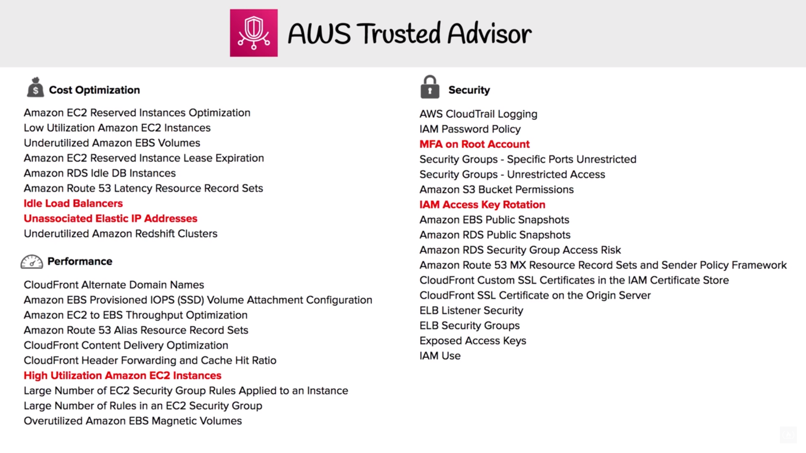
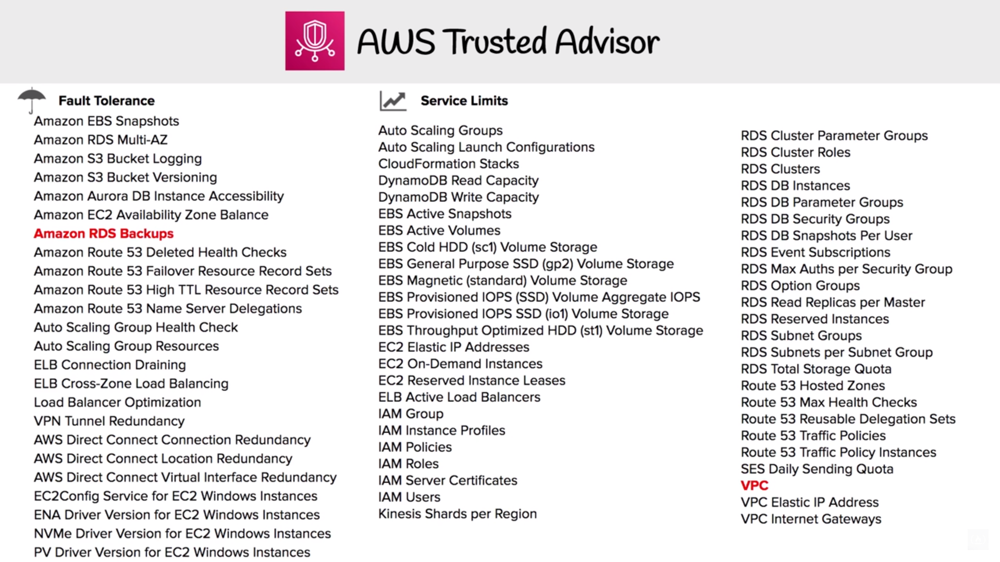

## Consolidated Billing

One bill for all your accounts. Consolidate your billing and payment methods across multiple AWS accounts into one bill.  
For billing AWS treats all the accounts in an organization as if they were one account. You can designate one master account that pays the charges of all the other member accounts.

Consolidated billing is offered at no additional cost! Use Cost Explorer to visualize usage for consolidated billing.

## Consolidated Billing Volume Discoints

AWS has Volume Discounts for many services. The more you use, the more you save. Consolidated Billing lets you take advantage of Valume Discounts. (First 10 TB = 0.17 / Next 40 TB = 0.13)

## AWS Cost Explorer

AWS Const Explorer lets you visualize, understand and manage your AWS costs and usage over time. If you have multiple AWS accounts within an AWS organisation costs will be consolidated in the master account. Default reports help you gain insight into cost drivers and usage trends. Use forecasting to get an idea of future costs. Used to budget costs BEFORE they have been incurred.  
A tag is a label that you or AWS assigns to an AWS resource. Each tag consists of a key and a value. For each resource, each tag key must be unique, and each tag key can have only one value. You can use tags to organize your resources, and cost allocation tags to track your AWS costs on a detailed level. After you activate cost allocation tags, AWS uses the cost allocation tags to organize your resource costs on your cost allocation report to make it easier for you to categorize and track your AWS costs. AWS provides two types of cost allocation tags, an AWS generated tags and user-defined tags. AWS defines, creates, and applies the AWS generated tags for you, and you define, create, and apply user-defined tags. You must activate both types of tags separately before they can appear in Cost Explorer or on a cost allocation report.

## AWS Budgets

First two budgets are free of charge. Each budget is \$0.02 per day ~0.60 USD/month, 20.000 budgets limit.
Plan your service usage, service costs and Instance reservations. Budgets give you the ability to setup alerts if you exceed or are approaching your defined budget. Used to budget costs BEFORE they have been incurred. Three budget types are available - cost, usage, and reserved instance utilization.

Create Cost, Usage or Reservation Budgets. Can be tracked at the monthly, quarterly, or yearly levels, with customizable start and end dates. Alerts support EC2, RDS, Redshift and ElastiCache reservations.

Budget based on a fixed cost or plan your upfrony based on your chosen level. Can be easily manage from the AWS Budgets dashboard or via the Budgets API. Get Notified by providing an email or Chatbot and threshold how close to the current or forecasted budget.

## AWS Simply Monthly Calculator
It is used to calculate your running costs on AWS on a per month basis. It is not a comparison tool.
## TCO Calculator

The Toal Cost of Ownership allows you to estimate how much you would save when moving to AWS from on-premise. Provides you detailed set of reports that can be used in executive presentations. It is used to compare the costs of running your infraestructure on premise vs in the AWS cloud. It will generate reports that you can give your C-level execs to make a business case to move to the cloud.

The tool is built on underlying calculation models that generate fair assessments of value that you can achieve given the data provided. This TCO helps by reducing the need to invest in large capital expenditures. The tool is for approximation purposes only.
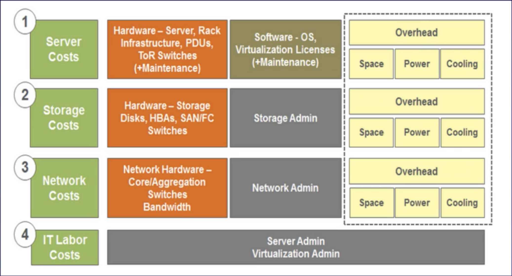

## AWS Landing Zone

Helps ENterprises quickly set-up a secure, AWS multi-account. Provides you with a baseline environment to get started with a multi-account architecture.

AWS Account Vending Machine (AVM): Automatically provisions and confgure new accounts via Service Catalog Template. Uses Single Sign-on (SSO) for managing and accessing accounts.

The environment is customizable to allow customers to implement their own account baseline through a Landing Zone configuration and upate pipeline.

## Resource Groups and Tagging

Tags are words or phrases that act as metadata for organizing your AWS resources. Tags are key value pairs attached to AWS resources. This tags can also be inherited. Resource Groups are a collection of resources that share one or more tags, they make easy to group your resources using the tags.

Helps you organize and consolidate information based on your project and the resources that you use. Resource groups can display details about a group of resource based on Metrics, Alarms and Configuration Settings. At any time you can modify the settingd of your resource groups to change what resources appear.

## AWS QuickStart

Prebuilt templates by AWS and AWS Partners to help you deploy popular stacks on AWS. Reduce hundreds of manual procedures into just a few steps. A quick Start is composed by 3 parts:

- A reference architecture for the deployment.
- AWS CloudFormation templates that automate and configure the deployment.
- A deployment guide explaining the architecture and implementation in detail.

Most Quick Start reference deployments enable you to spin up a fully functinal architectire in less than an hour!

## AWS Cost and Usage Report

Generate a detailed spreadsheet, enabling you to better analyze and understand your AWS costs. It places the report into S3.

You can use Athena to turn the report into a queryable database ans use QuickSight to visualize your billing as graphs.

## AWS Partner Program
There are two types of partners:
- Consulting: These partners design, architect, build, migrate, and manage customer workloads and applications on AWS.
- Technology: These partners provide hardware, conectivity services, or software solutions that are either hosted on, or integrated with, the AWS cloud.  
Employees consulting partner table:
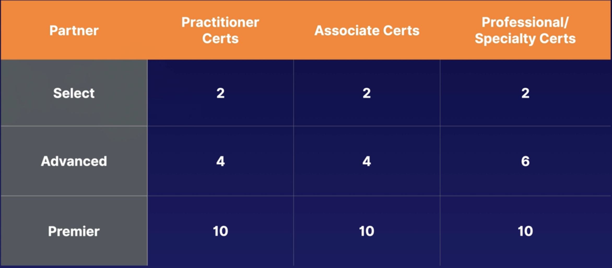

# Technology Overview

## AWS Organizations and Accounts

Organizations allow you to centrally manage billing, control access, compliance, securit, and share resources across your AWS accounts.

Root Account User is a single sign-in identity that has complete access to all AWS services and resources in an account. Each account has a Root Account User.

Organization Units are a group of AWS accounts within an organization which can also contain other organizational units - creating a hierarchy.

Service Control Policies give central control over the allowed permissions for all accounts in your organization, helping to ensure your accountd stay within your organization, helping ti ensure your accounts stay eithin your organizations guidelines.

Best practices are always enable multifactor authentication for the root acount, use a strong and complex password for the root account, paying account should be used for billing purposes only (do not deploy resources into the paying account).  

You can have up to 20 linked accounts. When monitoring is enabled on the paying account, the billing data for all linked accounts is included but you can still create billing alerts per individual account.

## AWS Networking

- Region: the geographical location of your network.
- AZ: the data of your AWS resources.
- VPC: A logically isolated section if the AWS Cloud where you can launch AWS resources
- Internet Gateway: Enable access to the Internet
- Route tables: Determine where network traffic from your subnets are directed
- NACLs: Acts as a firewalls at the subnet level
- Security Groups: Acts as firewalls at the instance level to control inbound and outbound traffic. When you launch an instance in a VPC, you can assign up to five security groups to the instance. Security groups act at the instance level, not the subnet level. Therefore, each instance in a subnet in your VPC can be assigned to a different set of security groups.
- Subnets: A logical partition of an IP network into multiple, smaller network segments

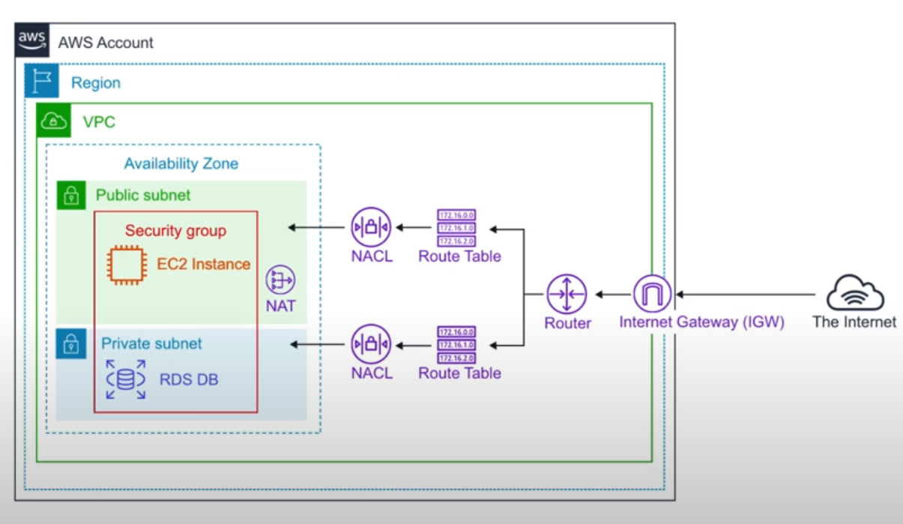

## Database Services

- DynamoDB: NoSQL key/value database
- DocumentDB - NoSQL Document database that is MongoDB compatible.
- RDS (OLTP): [Relational Database Service](https://docs.aws.amazon.com/AmazonRDS/latest/UserGuide/Welcome.html#Welcome.Concepts) that supports multiple engines (MySQL, Postgres, Maria DB, Oracle, Microsoft SQL Server, Aurora). It runs in multiple AZ for disaster recovery and has read replicas to avoid high workloads in the main instance. 
  - Aurora: MySQL (5x faster) and PSQL (3x faster) database fully managed
  - Aurora Serverless: Only runs when you need it, like AWS Lambda
- Neptune: Managed Graph Database
- Redshift (OLAP): Columnar database, petabyte warehouse
- ElastiCache: Redis or Memcached database. Is a web service that makes it easy to deploy, operate and scale an in-memory cache in the cloud. Improves the perfomance by allowing you to retrieve information from fast, managed, in-memory caches instead of slower disks.

## Provisioning Services

Provisioning is the alllocation or creation of resources and services to a customer.

- Elastic Beanstalk: Service for deploying and scaling web applications and services developed with Java, .NET, PHP, Node.js, Ruby, Go and Docker. It provisions automatically all the necessary resources, such as EC2 instances, security groups, ALB...
- OpsWork: Configuration management service that provides managed instances of Chef and Puppet
- CloudFormation: Infraestructure as code JSON or YAML. Helps you model and set up AWS services resources. You create a template that describes all the resource you want and CloudFromation takes care of provisioning and configuring that resources.
- AWS QuickStart: Pre made packages that can laynch and configure your AWS compute, network, storege and other services required to deploy a workload on AWS
- AWS Marketplace: A digital catalogue of thousands of software listings from independent software

## Computing Services

- EC2: Elastic Compute Cloud, highly configurable server. Virtual Machines in the cloud.
- ECS Elastic Container Service, Docker as a Service highly scalable, high perfornabce container orchestration service that supports Docker containers, pay for EC2 instances
- Fargate: Microservices where you do not think about the infraestructure. Pay per task.
- EKS: Kubernetes as a Service eassy ti deploy, manage and scale containerized applications using Kubernettes
- Lambda: Serverless functions run code without provinioning or managing servers. You pay only for the compute time you consume
- Elastic Beanstalk: Orchestrates various AWS services, including EC2, S3, Simple Notification Service (SNS), CloudWatch, autoscaling and Elastic Load Balances. PaaS compute service.  
- AWS Batch plans, schedules and executes your batch computing workloads accross the full range of AWS vompute sevices and features, such as Amazon EC2 and Spot Instances
 - Lightsail. Simple cloud servers.
 - Serverless Application Repository. Allows you to deploy pre-provisioned serverless applications.
 - AWS Outposts. A way of extending compute to your own data centers or on-premises.
 - EC2 Image Builder. Helps you build your own custom EC2 images for linux and windows.

## Storage Services

- S3: Simple Storage Service, object storage. Is a safe place to store your files, object based storage.  
Files can go from 0 bytes to 5 TB, there is unlimited storage and files are stored in Buckets. It is a universal namespace and you receive an HTTP 200 code if the upload was successful. Objects cosist of Key, Value, Version ID, metadata, subresources (ACL, Torrent).  
  - Data consistency: Read after Write consistency for PUTS of new Objects, eventual consistency for overwrite PUTS and DELETES.  
  - Features: Tiered Storage Available, Lifecycle Management, Versioning, Encryption, Secure your data using ACL and Bucket Policies.  
  - Storage Classes ([Comparison Table](https://docs.aws.amazon.com/AmazonS3/latest/userguide/storage-class-intro.html#sc-compare)): 
    - S3 Standard: 99 Avail and 11 x 9s Durab, stored redundant across multiple devices in multiple facilities and is designed to sustain the loss of 2 facilities concurrently.
    - S3 IA: Infrequenty Accessed data but required rapid access when needed. Lower fee but retrieval fee charged.
    - S3 One Zone IA: For when you want a lower-cost option for IA data but do not require the multiple AZ data resilience.
    - S3 Intelligent Tiering: Designed to optimize the costs by automatically moving data to the most cost-effective access tier, without performance impact or operational overhead.
    - S3 Glacier: A secure, durable and low-cost storeage class for data archiving. You can reliably store any amount of data at costs that are competitive with or cheaper than on-premises solutions. Retrieval times configurable from minutes to hours. In S3 Glacier, a vault is a container for storing archives. When you create a vault, you specify a name and choose an AWS Region where you want to create the vault. An archive can be any data such as a photo, video, or document and is a base unit of storage in S3 Glacier. Each archive has a unique ID and an optional description. minimum storage duration period of 90 days and can be accessed in as little as 1-5 minutes using expedited retrieval. If you have deleted, overwritten, or transitioned to a different storage class an object before the 90-day minimum, you are charged for 90 days.
    - S3 Glacier Deep Archive: AWS S3 Lowest-cost storage class where a retrieval time of 12 hours is acceptable.
    - S3 Outposts: It has been introduced as a storage class to deliver object storage to on-premises AWS Outpost environments.
  - Charges: In S3 you are charged by Storage, Requests, Storage Management Pricing, Data Transfer Pricing, Transfer Acceleration, Cross Region Replication Pricing.
  - Restricting Bucket Access: Bucket Policies (whole bucket), Object Policies (individual files), IAM Policies (users and groups).
  - Static Website: It scales automatically to meet your demand and can serve non complex websites.
  - Versioning: Whenever you make a change in a file a new version is stored and can recover the previous ones.
- Storage Gateway: Hybrid cloud storage with local caching (File Gateway, Volume Gateway, Tape Gateway). Data is replicated to AWS S3 buckets.
- EBS: Elastic Blok Storage, hard drive in the cloud you attach to EC2 instances (SSD, IOPS SSD, Throughput HHD, Cold HHD). Amazon EBS volumes are placed in a specific AZ, where they are automatically replicated to protect from failure. Kind of EBS storage:
  - SSD: General Purpose SSD (GP2) that balances price and performance, Provisioned IOPS SSD (IO1) have a highest performance for mission-critical-low-latency or high throughput workloads.
  - Magenetic: Thoughput Optimized HDD (ST1) Low cost HDD volume designed for Frequently Accessed and throughput-intensive workloads, Cold HDD (SC1) Lowest cost HDD volume designed for less frequently accessed workloads (File Servers), Magnetic Previouus Generation.
- EFS: Elastic File Storage, file storage mountable to multiple EC2 instances at the same time
- Snowball: Physically migrate lots of data via a computer suitvase 50-80 TB
  - Snowball Edge: A better version of Snowball 100 TB, it comes with a CPU and allows you to deploy Lambda functions on premise
  - Snowmobile: Shipping container, pulled by a semi trailer truck 100 PB

## Business Centric Services

- Amazon Connect: Call Center, Cloud Based call cebter service you can setup in just a few clicks. Based on the same proven system used by the Amazon customer services teams.
- WokSpaces: Virtual Remote Desktop, Secure managed service for provisioning either Windows or Linux desktops in just a few minutes it quickly scales up to thousands of desktops.
- WorkDocs: A content creation and collaboration service easily create, edit and share contet saves centrally in AWS (AWS version of Sharepoint).
- Chime: AWS Platform for online meetings, video conferencing and business calling which elastically scales to meet your capacity needs.
- WorkMail: Managed business email, contacts and calendar service with support fot existing desktop and mobile email client applications (IMAP).
- Pinpoint: Marketing campaign management system you can use for sending targeted email, SNS, push notifications and voice messages.
- SES (Simple Email Service): A cloud based email sending service designed for marketers and application developers to send marketing, notification and emails.
- QuickSight: A Business Intelligence (BI) service. Connect multiple datasource and quickly visualize data in the form if graphs with little to no programming knowledge.

## Enterprise Integration

- Direct Connect: Dedicated Gigabit network connection from your premises to AWS. Imagine having a direct fiber optic running straight to AWS.
- VPN: Establish a secure connection to your AWS network.
  - Site-to-Site: Connecting your on-premise to your AWS network
  - Client VPN: Connecting a Client to your AWS network
- Storage Gateway: A hybrid storage sevice that enables your on-premise applications to use AWS cloud storage. You can use this for backup and archiving, disaster recovery, cloud data processing, storage tiering and migration.
- Active Directory: The AWS Directory Service for Microsogt Active Directory also known as AWS Managed Microsoft AD. Enables your directory-aware workloads and AWS resources to use managed Active Directory in the AWS Cloud.

## Logging Services

- Cloud Trail: Logs all API calls (SDK, CLI) between AWS services (who can we blame). Detect developer misconfiguration, malicious actors or automate responses.
- CloudWatch: Is a collection of multiple services. We can think about it as a personal trainer in a gym. It can monitor EC2, Autoscalling groups, ELB, Route53 Health Checks, Storage and Content Delivery, EBS Volumes, Storage Gateways, CloudFront. It can monitor AWS as well as your applicationsrunning on AWS. Cloudwatch EC2 will monitor in a 5 min interval but can be turned into detail of 1 minute. You can create CloudWatch Alarms which trigger notifications.
  - CouldWatch Logs: Performance data about AWS Services (CPU, Memory, Network On Application Logs, Lanbda Logs...)
  - CloudWatch Metrics: Represents a time ordered set of data points. A variable to monitor.
  - CloudWatch Events: Trigger an even based on a condition
  - CloudWatch Alarms: Triggers notifications based on metrics
  - CloudWatch Dashboard: Create visualizations based in metrics

## Initialism

- IAM: Identity and Accesss Management
- S3: Simplre Storage Service
- SWF: Simple Workflow Service
- SNS: Simple Notification Service
- SQS: Simple Queue Service
- SES: Simple Email Service
- SSM: Simple Systems Manager
- RDS: Relational Database Service
- VPC: Virtual Private Cloud
- VPN: Virtual Private Network
- CFN: CloudFormation
- WAF: Web Applications Firewall
- MQ: Amazon ActiveMQ
- ASG: Auto Scaling Group
- TAM: Technical Account Manager
- ELB: Elastic Load Balancer
- ALB: Application Load Balancer
- NLB: Network Load Balancer
- EC2: Elastic Cloud Comnpute
- ECS: Elastic Container Service
- ECR: Elastic Container Repository
- EBS: Elastic Block Storage
- EFS: Elastic File Storage
- EMR: Elastic MapReduce
- EB: Elastic Beanstalk
- ES: Elasticsearch
- EKS: Elastic Kubernetes Service
- MKS: Managed Kafka Service
- IoT: Internet of Things
- RI: Reserved Instaces

# Security

## Shared Responsability Model

Customers are responsible for Security in the Cloud. AWS is responsible for Security of the Cloud.

## AWS Compliance Programs

Compliance Programs: A set of internal policies and procedures of a company to comply with laws, rules and regulations or to uphold business reputation.

## AWS Artifact

How do we probe AWS meets a compliance?  
No cost, self-service portal for on-demand access to AWS compliance reports. On-demand access to AWS security and compliance reports and select online agreements. These checks are based on global compliance frameworks.

## Amazon Inspector

How do we prove an EC2 Instance is harden?  
Hardening is the act of eliminating as many security risks as possible. AWS Inspector runs a security benchmark against specific EC2 instances.

You can run a variety of security benchmarks. Can perform both Network and Host Assessments:

- Install the AWS agent on your EC2 instances
- Run an assessment for your assessment target
- Review your findings and remediate security issues

## AWS WAF

AWS Web Application Firewall protect your web applications from common web exploits that could affect application availability, compromise security, or consume excessive resources. Write your own rules to ALLOW or DENY traffic based on the contents of an HTTP requests. Use a ruleset from a trusted AWS Security Partner in AWS WAF Rules Marketplace. WAF can be attached to either CloudFront or an Application Load Balancer.

Protect web applications from attacks covered in the OWASP Top 10 most dangerous attacks:

1. Injection
2. Broken Authentication
3. Sensitive data exposure
4. XML External Entities (XXE)
5. Broken Access control
6. Security misconfigurations
7. Cross Site Scripting (XSS)
8. Insecure Deserialization
9. Using Components with known vulnerabilities
10. Insuficient logging and monitoring

## AWS Shield

AWS Shield is a managed DDoS (Distributed Denial of Service) protection service that safeguards applications running on AWS. It provides always-on detection and automatic inline mitigations that minimize application downtime and latency.  
All AWS customers benefit from the automatic protectiond of AWS Shield Standard at no additional charge. When you rute your traffic throug Route53 or CloudFront you are using AWS Shield Standard. Protects you against Layer 3 (network), 4 (Transport) and 7 (Application).

- Shield Standard (Free): For protection against most common DDoS attacks and access to tools and best practices to build a DDoS resilient architecture. Automatically available on all AWS services.
- Shield Advanced (3000 USD / Year): For addtiional protection against larger and more sophisticated attacks, visibility into attacks and 24x7 access to DDoS experts for complex cases. Available on Route53, CloudFront, Elastic Load Balancing, AWS Global Accelerator, Elastic IP (Amazon Elastic Compute Cloud and Network Load Balancer)

## AWS Config
Provides a detailed view of the configuration of AWS resources in your AWS account. This includes how the resources are realted to one another and how they were configured in the past so that you can see how the configurations and relationships change over time. It is a region specific service.
## Penetration Testing

Pentesting is an authorized somulated cyberattack on a computer system, performed to evaluate the security if the system. Can you perform Pentesting on AWS?:

- Permitted Services:
  - EC2 instances, NAT GAteways and ELB
  - RDS
  - CloudFront
  - Aurora
  - API Gateways
  - AWS Lambda and Lanbda@Edge functions
  - Lightsail resources
  - Elastic Beanstalk environments
- Prohibited Activities:
  - DNS zone walking via Amazon Route 53 Hosted Zones
  - Denial of Service (DoS), Distributed Denial of Service (DDoS), Simulated DoS, Simulated DDoS
  - Port flooding
  - Protocol flooding
  - Request flooding (login request flooding, API request flooding)

For Other Simulated Events you will need to submit a request to AWS. A reply could take up to 7 days.

## GuardDuty

IDS/IPS (Intrusion Detection System and Intrusion Protection System) is a device os software application that monitors a network or systems for malicious activity or policy violations. One click to enable it (30 day trial), it is enabled just across the one account (but it can be enabled across multiple accounts using AWS Control Tower)  

GuardDuty is a threat detection service that contiuously monitors for malicious, suspicious activity and unauthorized behavior. It uses Machine Learning to analyze the following AWS logs:  

- CloudTrail Logs
- VPC Flow Logs
- DNS logs
  It will alert you of Findings which you can automate a incident response via CloudWatch Events or with third party Services.

## Control Tower
It provides the easiest way to set up and govern a new, secure, multi-account AWS environment. Allows you to provision multiple AWS accounts in just a few minutes, those accounts will conform to company policies. Used for large enterprise with multiple AWS accounts.
## Security Hub
Security Hub gives you a comprehensive view of your security alerts across multiple AWS accounts. A single place that aggregates, organizes, and prioritizes your security alerts or findings from multiple AWS services (such as GuardDuty, Inspector, Macie, IAM, Access Analyzer and Firewall Manager) across multiple AWS accounts.
## Key Management Service (KMS)

A managed regional service that makes it easy fot you to create and control the encryption keys used to encrypt your data. It is on shared hardware but completely isolated (not dedicated):

- KMS is a multi-tenant HSM (hardware security module)
- Many AWS services are integrated to use KMS to encrypt your data with a simple checkbox
- KMS uses Envelope Encryption: When you encrypt your data, your data is protected, but you have to protect your ecryption key. You encrypt your data key with a master key as an additional layer of security.
  
KMS is priced per customer master key and the number of requests received per month.
## CloudHSM
It is a dedicated hardware security module, not multitenant and multi AZ cluster. It complains with FIPS140-2 Level 3 (Federal Information Processing Standards)
## Parameter Store
It is a component of AWS Systems Manager (SSM). It provides secure serverless storage for configuration and secrets (passwords, db conenction strings, etc). Values can be stored encrypted (KMS) or plain text, a TTL can be used to expire values. There is no cost to use it but it has a limit of 10000 parameters per account.
## Secrets Manager
It is similar to parameter store but it does cost money. You are charged per secrets stored and also per 10000 api calls. It has some added advantages:
- Automatically rotate secrets
- Apply the new key/password in RDS for you (useful when using CloudFormation)
- Generate random secrets
## Athena
It is an interactive query service which enables you to analyse and query data located in S3 using standard SQL:
- It is serverless, nothing to provision, pay per query / per TB scanned.
- No need to set up complex Extract/Transform/Load (ETL) processes.
- Works directly with data stored in S3.  
It can be used for:
- Query log files stored in S3.
- Generate business reports on data stored in S3.
- Analyse AWS costs and usage reports.
- Run queries on click-stream data.
## Amazon Macie
What is PII (Personally Identifiable Information)?:  
- Personal data used to establish an individual's identity.
- This data could be exploited by criminals, used in identity theft and financial fraud.  

Macie is a secutiry service which uses ML and NLP to discover, classify and protect sensitive data stored in S3. Macie is a fully managed service that continuously monitors S3 data access activity for anomalies and generates detailed alerts when it detects risk of unauthorized access or inadvertent data leaks:
- Uses AI to recognise if your S3 objects contain sensitive data such as PII.
- Dashboards, reporting and alerts.
- Works directly with data stored in S3.
- Can also analise CloudTrail logs.
- Great for PCI-DSS and preventing ID theft.

Macie works by uses Machine Learning and NLP to Analyze your CloudTrail logs. Macie has a variety of alerts:

- Anonymized Access
- Config Compliance
- Credential Loss
- Data Compliance
- File Hosting
- Identity Enumeration
- Information Loss
- Location Anomaly
- Open Permissions
- Privilege Escalation
- Ransomware
- Service Disruption
- Suspicious Access

Macie will identify your most at-risk users which could lead to a compromise.

## Security Groups vs NACLs

- Security Groups: Acts as a firewall at the instance level. Implicily denies all traffic. You create Allow rules. ( allow access on an EC2 on port 22)
- NACLs: Acts as a firewall at the subnet level. You create Allow and Deny rules. (block specific IP)

## AWS VPN

Lets you establish a secure and pricate tunnel from your network or device to the AWS global network.

- AWS Site-to-Site VPN: Securely connect on-premises network or branch office site to VPC
- AWS Client VPN: Securely connect users to AWS or on-premises networks.

# Variation Study

## Cloud Service

Similar names, completely different services:

- CloudFormation: Infrestructire as code, set up services via templating script (yml,json)
- CloudTrail: Logs all api call between AWS services. Per AWS account and is enabled per region, can consolidate logs using an S3 bucket.
- CloudFront: Content Distribution Network. it create a caches copy of your website and copies to severs located near people trying download website. The content from Origin (origin of files S3, EC2...) is served over the Edge Locations by a Distribution (name given to the collection of Edge Locations known as CDN). The file is cached for a number of a length of time and thats specified by TTL (default 24h - 86400s). Distributions can be of kind Web Distribution and RTMP (media streaming).
- CloudWatch: Is a collection of multiple services (Logs, Metrics, Events, Alarms, Dashboard). It monitors performance.
- CloudSearch: Search engine, you have an ecommerce webdite and you want to add a search bar

## Connect Service

- Direct Connect: Dedicated Fiber Optics Connections from DaraCenter to AWS. A large enterprise has their own datacenter and they need an insalnely fast connection directly AWS. Of you need to security you can apply a VPN connect on-top pf Direct Connect.
- Amazon Connect: Call Center Service. Get a toll free number, accpet inbound and outbound calls, setup autonated phone systems.
- Media Connect: New Version of Elastic Transcoder, converts videos to different video types.

## Elastic Transcoder vs Media Connect

Both services transcode videos:

- Elastic transcoder: The old way. Transcodes videos to streaming formats.
- AWS Elemental MediaConvert: The new way. Transcodes videos to straming formats, overlays images, insert video clips, extracts captions data, robust UI.

## SNS vs SQS

They Both Connect Apps via Messages

- Simple Notifications Service: Pass Alongs Messages  
  Send notifications to Subscribers of topics via multiple protocol (HTTP, email, SQS, SMS). SNS is generally used for sending plain text emails which is triggered via other AWS Services. The best example of this is billing alarms. Can retry sending in case of failure for HTTPS. Really good for webhooks, simple internal email, triggering lamda functions. (PubNub)

- Simple Queue Service: Queue up Messages, Guarateed Delivery
  Places messages into a queue. Applications pull queue using AWS SDK. Can retain a message for up to 14 days, can send them in sequential order or in parallel, can ensure only one messsage is sent, can ensure messages are delivered at least once. Really good for delayed tasks, queuing up emails. (RabbitMQ)

## Inspector vs Trusted Advisor

Both are security tools and they both perform audits.

- Amazon Inspector: Audits a single EC2 Instance that you have selected. Generates a report from a long list of security checks. A rule is a security check that the AWS agent performs during an assesment run.

- Trusted Advisor: Trusted Advisor do not generate out a PDF report. Gives you a holistic view of recommendations across multiple services and best preactices. You should enable MFA on your root account when using trusted advisor.

## ALB vs NLB vs CLB

- Application: Layer 7 Requests. HTTP and HTTPS traffic. Routing Rules, more usability from one load balancer. Can attach WAF.
- Network: Layer 4 IP protocol data. TCP and TLS traffic where extreme performance is required. Capable of handling millions of requests per second while maintaining ultra low latencies. optimized for sudden and volatile traffic patterns while using a single static IP address per AZ.
- Classic: Layer 4 and 7. Inteded for applications that were built within the EC2 Classic Network. Does not use Target Groups.

> Can attach Amazon Certification Manager (ACM) SSL Certificate.

## SNS vs SES

- Simple Notifications Service: Practical and Internal. Send notifications to subscribers of topics via multiple protocol (HTTP, Email, SQS, SMS...) SNS is generally used for sending plain text emails which is triggered via other AWS Services. The best example of this is billing alarms.

- Simple Email Services: Professional, Marketing, Emails. A cloud based email service eg. SendGrid. SES sends html emails, SNS cannot. SES can recive inbound emails. SES can create Email Templates. Custom domain name emails. Monitor your email reputation.

## Artifact vs Inspector

Both compile out PDFs

- AWS Artifact: Why should an enterprise trust AWS? Generates a security report thats based on global compliance frameworks such as Service Organization Control or Payment Card Industry

- AWS Inspector: How do we knoe this EC2 instance is Secure? Prove it? Runs a script that analyzes your EC2 instance, then generates a PDF report telling you which security checks passed. Audit tool for security of EC2 instances.

## S3 vs EBS vs EFS
- S3. Safe place to store your files, object-based, data is spread across multiple devices and facilities.
- EBS. Virtual hard disk in the cloud. It provides persistent block storage volumes for EC2. Each EBS volume is automatically replicated within its AZ to protect you from component failure.
- EFS. File Storage service for EC2 but it automatically adjusts size as you add or remove files from it. It can also be accessed from different EC2 instances.

# Advanced AWS Concepts
## AI Services
- Lex: Powers Amazon Alexa and allows you to build conversational chatbots, can be poweredeither via voice or text.
- Polly: Powers Amazon Alaexa, it converts text to life-like voice. You can chose between a number of different languages, whether the voice is male or female, and even what accent you would like the voice to be rendered in.
- Transcribe: Converts speech into text. This can be great for generating subtitles or getting transcripts of interviews, speeches and more.
- Rekognition. A way of converting images into tags/text. Upload an image and rekognition will tell you it thinks the image is with a certain degree of confidence.
## EC2 Licensing
An Amazon EC2Dedicated Host is a physical server with EC2 instance capacity fully dedicated to your use. Dedicated Hosts allow you to use your existing per-socket, per-core, or per-VM software licenses, including Windows Server, MSQL, SUSE, etc
## VPC
Amazon Virtual Private Cloud lets you provision a logically isolated section of the AWS cloud where you can launch AWS resources in a virtual network you define. You have complete control over your virtual networking environment, including selection of your own IP address range, creation of subnets, etc.
## Lambda
It is the ultimate absraction layer, it gets rid of datacenters, OS, Assembly Code/ Protocols, amazon manages all that for you. It is a compute service where you can upload your code and create a Lambda function. AWS Lamnda takes care of provisioning and managing he servers you use to run the code.  
Lambda is an event-driven compute service that can run your code in response to events. These events could be changes to data in S3 bucket or a Dynamo DB table. It supports NodeJs, Java, Python, C#, Go, PowerShell.  
Lambda is priced based on:
- Number of requests. First 1 Million Free, 0.20 per 1 Million requests thereafter.
- Duration. It is calculated from the time your code begins executing until it returns or otherwise terminates, rounded up to the nearest 100ms. The price depends on the amount of memory you allocate to your function. You are charged 0.00001667 for every GB-second used.  
You can use version control with Lambda to have multiple versions of your code. You can roll back your code at any time, restoring previous versions.  
Key features:
- Lambda scales out (not up) automatically.
- Lambda functions are independent (1 event = 1 function).
- Lambda is serverless.
- Know how Lambda is priced (per invocation and per execution time).
- You can have multiple versions of your code.  
AWS Lambda automatically monitors Lambda functions on your behalf, reporting metrics through Amazon CloudWatch.
## CodeCommit
AWS CodeCommit is a fully-managed source control service that hosts secure Git-based repositories. It makes asy for teams to collaborate on code in a secure and highly scalable ecosystem. CodeCommit eliminates the need to operate your own source control ecosystem or worry about scaling its infraestructure. You can use codecommit to securely store anything from source code to binaries, and it works seamlessly with your existing git tools.
## CodeDeploy
It is a fully managed deployment service that automates software deployments to a variety of compute services such as EC2, Fargate, Lambda, and your on-premises servers.
## Codestar
AWS CodeStar is a cloud-based service for creating, managing, and working with software development projects on AWS. You can quickly develop, build, and deploy applications on AWS with an AWS CodeStar project.
## AWS X-ray
It helps developers analyze and debug production, distributed applications, such as those built using microservices architecture. With X-ray you can understand how your application and its underlying services are performing to identify and troubleshoot the root cause of performances issues and errors. X-ray provides and end-to-end view of requests as they travel through your application, and shows a map of your application's underlying components.
## Elastic Load Balancer (ELB)
Elastic Load Balancing automatically distributes incoming application traffic across multiple targets, such as Amazon EC2 instances, containers, IP addresses, and Lambda functions. It can handle the varying load of your application traffic in a single Availability Zone or across multiple Availability Zones. Elastic Load Balancing offers three types of load balancers that all feature the high availability, automatic scaling, and robust security necessary to make your applications fault-tolerant:
- Application Load Balancer. Application Load Balancer is best suited for load balancing of HTTP and HTTPS traffic and provides advanced request routing targeted at the delivery of modern application architectures, including microservices and containers. Application Load Balancer routes traffic to targets within Amazon VPC based on the content of the request. You are charged for each hour or partial hour that an Application Load Balancer is running and the number of Load Balancer Capacity Units (LCU) used per hour.
- Network Load Balancer. It is best suited for load balancing of Transmission Control Protocol (TCP), User Datagram Protocol (UDP), and Transport Layer Security (TLS) traffic where extreme performance is required. Network Load Balancer routes traffic to targets within Amazon VPC and is capable of handling millions of requests per second while maintaining ultra-low latencies. You are charged for each hour or partial hour that an Application Load Balancer is running and the number of Load Balancer Capacity Units (LCU) used per hour.
- Gateway Load Balancer. It makes it easy to deploy, scale, and run third-party virtual networking appliances. Providing load balancing and auto scaling for fleets of third-party appliances, Gateway Load Balancer is transparent to the source and destination of traffic. This capability makes it well suited for working with third-party appliances for security, network analytics, and other use cases. You are charged for each hour or partial hour that an Application Load Balancer is running and the number of Load Balancer Capacity Units (LCU) used per hour.
- Classic Load Balancer. It provides basic load balancing across multiple Amazon EC2 instances and operates at both the request level and the connection level. Classic Load Balancer is intended for applications that were built within the EC2-Classic network. You are charged for each hour or partial hour that a Classic Load Balancer is running and for each GB of data transferred through your load balancer.
## AWS Kinesis
Amazon Kinesis makes it easy to collect, process, and analyze real-time, streaming data so you can get timely insights and react quickly to new information. Amazon Kinesis offers key capabilities to cost-effectively process streaming data at any scale, along with the flexibility to choose the tools that best suit the requirements of your application.
## Disaster recovery options in the cloud
[Disaster recovery](https://jayendrapatil.com/aws-disaster-recovery-whitepaper/) strategies available to you within AWS can be broadly categorized into four approaches, ranging from the low cost and low complexity of making backups to more complex strategies using multiple active Regions. It is critical to regularly test your disaster recovery strategy so that you have confidence in invoking it, should it become necessary.  

> Recovery Time Objective (RTO) – The time it takes after a disruption to restore a business process to its service level, as defined by the operational level agreement (OLA) for e.g. if the RTO is 1 hour and disaster occurs @ 12:00 p.m (noon), then the DR process should restore the systems to an acceptable service level within an hour i.e. by 1:00 p.m

> Recovery Point Objective (RPO) – The acceptable amount of data loss measured in time before the disaster occurs. for e.g., if a disaster occurs at 12:00 p.m (noon) and the RPO is one hour, the system should recover all data that was in the system before 11:00 a.m.

- Backup and restore. It is a suitable approach for mitigating against data loss or corruption. This approach can also be used to mitigate against a regional disaster by replicating data to other AWS Regions, or to mitigate lack of redundancy for workloads deployed to a single Availability Zone. In addition to data, you must redeploy the infrastructure, configuration, and application code in the recovery Region. To enable infrastructure to be redeployed quickly without errors, you should always deploy using infrastructure as code (IaC) using services such as AWS CloudFormation.
- Pilot light. With the pilot light approach, you replicate your data from one Region to another and provision a copy of your core workload infrastructure. Resources required to support data replication and backup, such as databases and object storage, are always on. Other elements, such as application servers, are loaded with application code and configurations, but are switched off and are only used during testing or when disaster recovery failover is invoked. Unlike the backup and restore approach, your core infrastructure is always available and you always have the option to quickly provision a full scale production environment by switching on and scaling out your application servers. CloudEndure Disaster Recovery uses the Pilot Light strategy, maintaining a copy of data and switched-off resources in an Amazon Virtual Private Cloud (Amazon VPC) used as a staging area. When a failover event is triggered, the staged resources are used to automatically create a full-capacity deployment in the target Amazon VPC used as the recovery location.
- Warm standby. It involves ensuring that there is a scaled down, but fully functional, copy of your production environment in another Region. This approach extends the pilot light concept and decreases the time to recovery because your workload is always-on in another Region. This approach also allows you to more easily perform testing or implement continuous testing to increase confidence in your ability to recover from a disaster.
  > The difference between pilot light and warm standby can sometimes be difficult to understand. Both include an environment in your DR Region with copies of your primary Region assets. The distinction is that pilot light cannot process requests without additional action taken first, whereas warm standby can handle traffic (at reduced capacity levels) immediately. The pilot light approach requires that you to “turn on” servers, possibly deploy additional (non-core) infrastructure, and scale up, whereas Warm Standby only requires you to scale up (everything is already deployed and running). Use your RTO and RPO needs to help you choose between these approaches.
- Multi-site active/active. You can run your workload simultaneously in multiple Regions as part of a multi-site active/active or hot standby active/passive strategy. Multi-site active/active serves traffic from all regions to which it is deployed, whereas hot standby serves traffic only from a single region, and the other Region(s) are only used for disaster recovery. With a multi-site active/active approach, users are able to access your workload in any of the Regions in which it is deployed. This approach is the most complex and costly approach to disaster recovery, but it can reduce your recovery time to near zero for most disasters with the correct technology choices and implementation (however data corruption may need to rely on backups, which usually results in a non-zero recovery point). Hot standby uses an active/passive configuration where users are only directed to a single region and DR regions do not take traffic. Most customers find that if they are going to stand up a full environment in the second Region, it makes sense to use it active/active. 

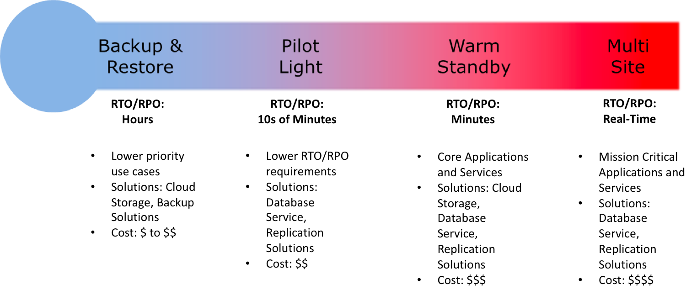
## Backup and restore
Backup and restore is a suitable approach for mitigating against data loss or corruption. This approach can also be used to mitigate against a regional disaster by replicating data to other AWS Regions, or to mitigate lack of redundancy for workloads deployed to a single Availability Zone. In addition to data, you must redeploy the infrastructure, configuration, and application code in the recovery Region. To enable infrastructure to be redeployed quickly without errors, you should always deploy using infrastructure as code (IaC) using services such as AWS CloudFormation or the AWS Cloud Development Kit (CDK). In addition to user data, be sure to also back up code and configuration, including Amazon Machine Images (AMIs) you use to create Amazon EC2 instances. You can use AWS CodePipeline to automate redeployment of application code and configuration.
## AWS Cognito
Amazon Cognito lets you add user sign-up, sign-in, and access control to your web and mobile apps quickly and easily. Amazon Cognito scales to millions of users and supports sign-in with social identity providers, such as Apple, Facebook, Google, and Amazon, and enterprise identity providers via SAML 2.0 and OpenID Connect.  
With Amazon Cognito, you pay only for what you use. There are no minimum fees and no upfront commitments. The Cognito Your User Pool feature has a free tier of 50,000 MAUs for users who sign in directly to Cognito User Pools and 50 MAUs for users federated through SAML 2.0 based identity providers. 
## AWS EMR
Amazon EMR (previously called Amazon Elastic MapReduce) is a managed cluster platform that simplifies running big data frameworks, such as Apache Hadoop and Apache Spark, on AWS to process and analyze vast amounts of data. Using these frameworks and related open-source projects, you can process data for analytics purposes and business intelligence workloads. Amazon EMR also lets you transform and move large amounts of data into and out of other AWS data stores and databases, such as Amazon Simple Storage Service (Amazon S3) and Amazon DynamoDB.
