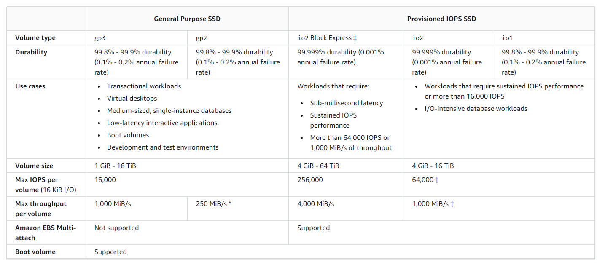
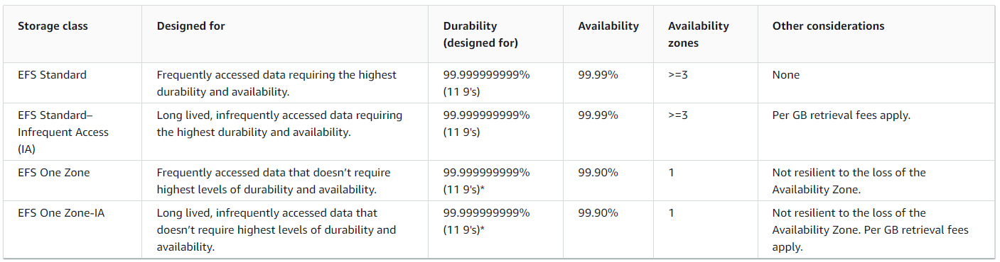

# Instance Storage

## EBS Storage Type

## Multi Attach
io1/io2 family can attach the same EBS volume to multiple instances. Each instance has full write/read access to the volume. The use cases are:
- Achieve higher application availability in clustered Linux applications.
- Applications must manage concurrent write opertations.
- Filesystem must be cluster-aware.

## EBS encryption
- When you create an encrypted EBS volume, you get the following:
  - Data at rest is encrypted inside the volume.
  - All the data in flight moving between the instance and the volume is encrypted.
  - All snapshots are encrypted.
  - All volumes created from snapshots are encrypted.
- Encryption and decryption are handled separately (you have noting to do).
- Encryption has a minimal impact on latency.
- EBS encryption leverages keys from KMS (AES-256)
- Copying an unencrypted snapshot allows encryption.
- Snapshots of encrypted volumes are encrypted.

> Encrypt unencrypted EBS volumes: Create a snapshot, encrypt the snapshot (using copy), create new volume from snapshot.

## EFS
- Elastic File System is a managed NFS that can be mounted on many EC2.
- EFS works with EC2 instances in multi-AZ.
- Highly available, scalable, expensive (3x gp2), pay per use.
- Use cases: content management, web serving, data sharing, wordpress.
- Uses NFSv4.1 protocol.
- Uses security group to control access to EFS.
- Compatible with Linux based AMI (not windows).
- Encryption at rest using KMS.
- POSIX file system (~linux) that has a standard file API.
- File system scales automatically, pay-per-use, no capacity planning.
## EFS Performance
- EFS scale:
  - 1000s of concurrent NFS clients, 10GB+ /s throughput.
  - Grow to Petabyte-scale network file system, automatically.
- Performance mode (set a EFS creation time):
  - General purpose (default): latency-sensitive use cases.
  - Max I/O: higher latency, throughput, highly parallel.
- Trhoughput mode:
  - Bursting (1 TB = 50MiB/s + burst of up to 100MiB/s)
  - Provisioned: set your trhoughput regardless of storage size.
## EFS Storage Classes

# HA and Scalability

## Elastic Load Balancers
- Classic Load Balancer(v1 old generation) - 2009 - CLB. HTTP, HTTPS, TCP, SSL(secure TCP)
- Application Load Balancer(v2 - new generation) - 2016 - ALB. HTTP, HTTPS, WebSocket
- Network Load Balancer(v2 - new generation) - 2017 - NLB. TCP, TLS(secure TCP), UDP
- Gateway Load Balancer - 2020 - GWLB. Operates at layer 3 (Network Layer) - IP Protocol
> Some load balancers can be setup as internal (private) or external (public) ELBs.

The load balancer security groups allow users t contact the load balancer on the desired ports. From the internal side the instance only need to allow traffic from the LB directly using a security group as source.

### Classic Load Balancer
Supports TCP(layer 4), HTTP and HTTPS(layer 7). Health checks are TCP or HTTP based. It has a fixed hostname (XXX.region.elb.amazonaws.com).

### Application Load balancer
Supports layer 7(HTTP). Load balancing to multiple HTTP applications across machines(target groups). Load balancing to multiple applications on the same machine(containers). Support for HTTP/2 and WebSocket. Support redirects (from HTTP to HTTPS for example).
Routing tables to different target groups:
- Routing based on path in URL
- Routing based on hostname in URL
- Routing based on query strings, headers.
> ALB are a great fit for micro services and container-based application. Has a port mapping feature to redirect to a dynamic port in ECS.  

Target groups for ALB:
- EC2 instances (can be managed by an Auto Scaling group) - HTTP
- ECS tasks (managed by ECS itself) - HTTP
- Lambda functions - HTTP request is translated into a JSON event.

ALB has a fixed hostname, the application servers do not see the IP of the client directly (the true IP of the client is inserted in the header X-Forwarded-For). We can also get the port (X-Forwarded-Port) and proto (X-Forwarded-Proto).

### Network Load Balancer
Supports layer 4. Forward tcp and udp traffic to your instances. Handle millions of requests per seconds, less latency. NLB has one static IP per AZ and supports assigning elastic IP.
> NLB are used for extreme performance, TCP or UDP traffic.

Target groups for NLB:
- EC2 instances (target group)
- IP address - must be private IP's
- Application load balancer

### Gateway Load Balancer
Deploy, scale and manage a fleet of 3 party nwetwork virtual appliances in AWS. Examples of use are: Firewalls, intrusion detection and prevention system, deep packet inspection systems, payload manipulation. Operates at layer 3(Network layer) IP packets. Transparent network gateway (single entry/exit for all traffic), load balancer. Uses the GENEVE protocol on port 6081.

Target groups for GWLB:
- EC2 instances
- IP address - must be private IP's

### ELB Sticky Sessions
It is possible to implement stickiness so that the same client is always redirected to the same instance behind a LB. It works for CLB and ALB. The cookie used for stickiness has an expirtaion date you control.
> Enabling stickiness may bring imbalance to the load over the backend EC2 instances.

Cookie Names:
- Application Based Cookies:
  - Custom Cookie: Generated by the target, can include any custom attributes required by the application, cookie name must be specified individually for each target group.
  - Application cookie: Generated by the load balancer, cookie name is AWSALBAPP.
- Duration-based cookies: Generated by the LB, cookie name is AWSALB for ALB or AWSELB for CLB.

### ELB Cross-Zone Load Balancing
Each load balancer instance distributes evenly across all registered instances in all AZ. On ALB it is always on and there is no charge for inter AZ data. On NLB is disabled by default and you pay charges for inter AZ data. On CLB is disabled by default and there is no charge for inter AZ data.

### ELB SSL Certificates
- CLB: Support only one SSL certificate. Must use multiple CLB for multiple hostname with multiple SSL certificates.
- ALB: Supports multiple listeners with multiple SSL certificates. Uses Server Name Indication (SNI) to make it work.
- NLB: Supports multiple listeners with multiple SSL certificates. Uses Server Name Indication (SNI) to make it work.

### ELB Connection Draining
It is called Connection Draining for CLB and Deregistration Delay for NLB and ALB. It is the time to complete "in-flight requests" while the instance is de-registering or unhealthy. Stop sending new requests to the EC2 instance which is de-registering. This time goes between 1 and 3600s (default 300s). Can be disabled by setting value to 0.

## Auto Scaling Groups
The goal of ASG is:
- Scale out to match an increased load
- Scale in to match a decreased load
- Ensure there is a minimum and a maximum number of EC2 instance running.
- Automatically register new instances to a LB.
- Re-create an EC2 instance in case a previous one is terminated

> ASG are free (you only pay for the underlying EC2 instances).

ASG attributes are defined in a Launch Template as well as Min/Max/Initial capacity and scaling policies. It is posible to scale an ASG based on CloudWatch alarms. 

### ASG Scaling Policies
- Dynamic Scaling Policies:
  - Target Tracking Scaling: Most simple and easy to set-up. Ex: AVG ASG CPU arround 40%
  - Simple / Step Scaling: When a cloudwatch alarm is triggered.
- Scheduled Actions: Anticipate a scaling based on known usage patterns.
- Predictive Scaling: Continuously forecast load and schedule scaling ahead.

> Good metrics to scale on: CPU AVG, RequestCountPerTarget, Average Network In/Out

Scaling Cooldowns: After a scaling activity happens, you are in the cooldown period (default 300s). During the cooldown period the ASG will not launch or terminate additional instances (to allow for metrics to stabilize).

ASG Default Termination Policy: Find the AZ which has the most number of instances. If there are multiple instances in the AZ to choose from, delete the one with the oldest launch configuration.  
ASG Lifecycle Hooks: By default as soon as an instance is launched in an ASG it is in service. You have the ability to perform extra steps before the instance goes in service. You have the ability to perform some actions before the instance is terminated.

# RDS
Is a managed service:
- Automated provisioning. OS patching
- Continous backups and restore to specific timestamp (Point in Time Restore)
- Monitoring dashboards
- Read replicas for improved read performance
- Multi AZ setup for DR (disaster recovery)
- Maintenance window for upgrades
- Scaling capability (vertical and horizontal)
> You cannnot ssh into yout instances

## RDS Backups
Backups are automatically enabled in RDS. Automated backups:
- Daily full backup of the database (during maintenance window)
- Transaction logs are backed-up by RDS every 5 minutes
- Ability to restore to any point in time (from oldest backup to 5 minutes ago)
- 7 days retention (can be increased to 35 days)  

DB snapshots:
- Manually triggered by the user
- Retention of backup for as long as you want

## RDS Storage Auto Scaling
Helps you increase storage on your RDS DB instance dynamically. When RDS detects you are running out of free database storage, it scales automatically. Avoid manually scaling your database storage. You have to set Maximum Storage Threshold (maximum limit for DB storage). You can automatically modify storage if:
- Free storage is less than 10% allocated storage
- Low-storage lasts at least 5 minutes
- 6 hours have passed since last modification
> Useful for applications with unpredictable workloads.

## RDS Read Replicas for read scalability
We can set up to 5 Read Replicas, within AZ, Cross AZ or Cross Region. Replication is async, so reads are eventually consistent. Replicas can be promoted to their own DB. Applications must update the connection string to leverage read replicas.  
Network Costs: For RDS replicas within the same region, you do not pay for data transfer between AZ. For cross region replicas you will incur in replication fees.

## RDS Multi AZ (Disaster Recovery)
It is sync replication. One DNS name (automatic app failover to standby DB). Failover in case of loss of AZ, loss of network, instance or storage failure. No manual intervention in apps. Not used for scaling.
> Read Replicas can be setup as Multi AZ for Disaster Recovery.  
From Singe-AZ to Multi-AZ: It is a zero downtime operation, just click on "modify" for the database. Internally a snapshot is taken, a new DB is restored from the snapshot in a new AZ and a synchronization is established between the two databases.

## RDS Security
### Encryption
At rest encryption:
- Possibility to encrypt the master and read replicas with AWS KMS
- Encryption has to be defined at lauch time.
- If the master is not encrypted, the read replicas cannot be encrypted.
- Transparent Data Encryption (TDE) available for Oracle and SQL Server.
In flight encryption:
- SSL certificates to encrypt data to RDS in flight.
- Provide SSL options with trust certificate when connecting to database.
- To enforce SSL:
  - PostgreSQL: rds.force_ssl=1 in the AWS RDS Console (Parameter Groups)
  - MySQL: Within the DB (GRANT USAGE ON *.* TO 'mysqluser'@'%' REQUIRE SSL;)

### Encryption Operations
- Encrypting RDS backups:
  - Snapshots of un-encrypted RDS databases are un-encrypted
  - Snapshots of encrypted RDS databases are encrypted
  - Can copy an snapshot into an encrypted one
- To encrypt an unencrypted RDS database:
  - Create a snapshot of the un-encrypted database
  - Copy the snapshot and enable encryption for the snapshot
  - Restore the database from the encrypted snapshot
  - Migrate applications to the new database abd delete the old database

### Network
- RDS databases are usually deployed within a private subnet, not in a public one.
- RDS security workd by leveraging security groups that constrols which IP/security groups can communicate with RDS.

### Access Management
- IAM policies help control who can manage AWS RDS (trhough RDS api)
- Traditional Username and Password can be used to login into the database
- IAM-based authenticatio can be used to login in to RDS MySQL and PostgreSQL

# Aurora
- It is a propietary technology from AWS.
- Postgres and MySQL are both supported as Aurora DB
- It is "AWS Cloud Optimized" and claims 5x performance improvement over MySQL on RDS, over 3x the performance of Postgres on RDS.
- Aurora storage automatically grows in increments of 10 GB, up to 128 TB
- Aurora can have 15 replicas while MySQL has 5, and the replication process is faster (sub 10 ms replica lag)
- Failover in Aurora is instaneous, it is HA native
- Aurora costs more than RDS (20% more)

## Aurora HA and Read Scaling
- 6 copies of your data across 3 AZ:
  - 4 copies out of 6 needed for writes
  - 3 copies out of 6 needed for reads
  - self healing with peer-to-peer replication
  - Storage is striped across 100s of volumes
- One aurora Instance takes writes (master)
- Automated failover for master in less than 30 seconds
- Master + up to 15 Aurora read replicas serve reads
- Support for Cross Region Replication

Aurora provides a writer Endpoint pointing to the master. Also provides a reader Endpoint for connection load balancing. AutoScaling can be configured for read replicas.

## Aurora Security
- Similar to RDS because uses the same engines
- ENcryption at rest using KMS
- Automated backups, snapshots and replicas are also encrypted
- Encryption in flight using SSL
- Possibility to authenticate using IAM token

## Aurora Advanced Concepts
- Replica autoscaling
- Custom endpoints. Define a subset of aurora instances as custom endpoints to use the ones we consider more powerful for example.
- Serverless. Automated database instantiation and autoscaling based on actual usage. Good for infreqquest, intermittent or unpredictable workloads. No capacity planning needed. Pay per second, can be more cost-effective.
- Multi-Master. In case you want inmediate failover for write node (HA). Every node does R/W - vs promoting a RR as the new master.
- Global. 1 primary region R/W and up to 5 RO regions, up to 16 replicas per scondary region, promoting another region has an RTO of < 1 min.
- Machine Learning. Enables you to add ML-based predictions to your applications via SQL. Simple, optimized and secure integration between Aurora and AWS ML services. Supported services: Amazon SageMaker, Amazon Comprehend.

# ElastiCache
- The same way RDS is to get managed Relational Databases.
- ElastiCache is to get managed Redis or Memcached.
- Caches are in-memory databases with really high performance, low latency.
- Helps reduce load off of databases for read intensice workloads.
- Helps make your application stateless.
- AWS takes care of OS maintenance / patching, optimizations, setup, configuration, monitoring, failure recovery and backups.
- Using ElastiCache involves heavy application code changes.

## ElastiCache Architecture
### DB Cache
- Applications queries ElastiCache, if not available, get from RDS and store in ElastiCache.
- Help relieve load in RDS.
- Cache must have an invalidation strategy to make sure only the most current data is used in there.
### User Session Store
- Users logs into any of the application.
- The application writes the session data into ElastiCache.
- The user hits another instance of our application.
- The instance retrieves the data and the user is already logged in.

## Redis vs Memcached
Redis:
- Multi AZ with auto-failover
- Read replicas to scale reads and have HA
- Data durability using AOF persistence.
- Backup and restore features.
Memcached:
- Multi-node for partitioning of data (sharding)
- No HA (replication)
- Non persistent
- No backup and restore
- Multi-threaded architecture

## Advanced Elasticache
- All caches in ElastiCache:
  - Do not support IAM authentication
  - IAM policies on ElastiCache aare only used for AWS API-leve security
- Redis AUTH:
  - You can set a "password/token" when you create a Redis cluster
  - This is an extra level of security for your cache (on top of security groups)
  - Support SSL in flight encryption
- Memcached:
  - Support SASL-based athentication (advanced)

Patterns for ElastiCache:
- Lazy Loading: all the read data us cached, data can become stale in cache
- Write Through: adds or update data inteh cache when written to a DB (no stale data)
- Session Store: store temporary session data in a cache (using TTL features)

Redis Use Case:
- Gaming Leaderboards are computationally complex
- Redis sorted sets guarantee both uniqueness and element ordering
- Each time a new elment added, it is ranked in real time, then added in the correct order

# Route 53
- A highly available, scalable, fully managed and Authoritative DNS.
- Route 53 is also a Domain Registrar
- Ability to check the health of your resources
- The only AWS service which provides 100% availability SLA

## Route 53 Records
- How you want to route your traffic for a domain
- Each record contains:
  - Domain/subdomain name
  - Record type
  - Value
  - Routing Policy (how route 53 responds to queries)
  - TTL
- Supports the following DNS record types: A/AAAA/CNAME/NS/CAA/DS/MX/NAPTR/PTR/SOA/TXT/SPF/SRV  

Route 53 Record types:
- A: maps to a hostname or IPv4
- AAAA: maps to a hostname or IPv6
- CNAME: maps a hostname to another hostname
  - The target is domain name which must have an A or AAAA record.
  - Can't create CNAME record for the top node of a DNS namespace (Zone Apex).
- NS: Name Servers for the Hosted Zone
  - Control how traffic is routed for a domain.

## Route 53 Hosted Zones
- A container for records that define how to route traffic to a domain and its subdomains.
- Public Hosted Zones: Contains records that specify how to route traffic on the internet (public domain names).
- Private Hosted Zones: Contains records that specify how to route traffic within one or more VPCs (private domain names).
- Pay 0.50 per month per hosted zone.

## Route 53 Routing Policy
Define how Route 53 responds to DNS queries. DNS does not route any traffic, it only responds to the DNS queries.
### Simple
- Typically route traffic to a single resource. 
- Can specify multiple values in the same record. 
- If multiple values returned a random one is chosen by the client.
- When alias enabled, specify only one AWS resource.
- Can't be associated with healthchecks.
### Weighted
- Control the % of requests that go to each specific resources.
- Assign each record a relative weight. Weights do not need to sum up to 100.
- DNS records must have the same name and type.
- Can be associated with Health Checks.
- Use cases: load balancing, testing new application versions, etc.
- Assign a weight of 0 to a record to stop sending traffic to a resource.
### Latency
- Redirect to the resource that has the least latency close to us.
- Super helpful when latency for users is a priority.
- Latency is based on traffic between users and AWS Regions.
- Can be associated with health checks (failover capability).
### Failover
Use when you want to configure active-passive failover. You can use failover routing to create records in a private hosted zone. Failover routing lets you route traffic to a resource when the resource is healthy or to a different resource when the first resource is unhealthy.
### Geolocation
- Different from latency based.
- This routing is based on user location.
- Specify location by continent, country or state (if there is overlapping, most precise location selected).
- Should create a default record (in case there is no match location).
- Can be associated with Health Checks.
### Geoproximity
- Route traffic to your resources based on the geographic location of users and resources.
- Ability to shift more traffic resources based on the defined bias.
- To change the size of the geographic region, specify bias values:
  - To expand (1 to 99) - more traffic to the resource.
  - To decerase (-1 to -99) - less traffic to the resource.
- Resources can be:
  - AWS resources (specify AWS region)
  - Non-AWS resources (specify Latitude and Longitude)
- You must use Route 53 Traffic Flow (advanced) for this feature.

## Route 53 Traffic Flow
- Simplify the proccess of creating and maintaining records in large and complex configurations.
- Visual editor to manage complex routing decision trees.
- COnfiguration can be saved as Traffic Flow Policy:
  - Can be applied to different Route53 hosted zones (different domain names)
  - Supports versioning

## Route 53 Health Checks
HTTP Health Checks are only for public resources. Health check => Automated DNS failover
### Health checks that monitor and endpoint
- About 15 global health checkers will check the endpoint health:
  - healthy/unhealthy threshold
  - interval
  - supported protocols are HTTP, HTTPS, TCP
  - if > 18% of health checkers reposrt the endpoint is healthy, Route53 considers it Healthy.
  - Ability to choose which locations you want Route53 to use.
- Health checks pass only when the endpoint responds with the 2xx and 3xx status codes.
- Health checks can be setup to pass/fail based on the text in the first 5120 bytes of the response.
- Configure your router/firewall to allow incoming requests from Route53 health checkers.

### Health checks that monitor other health checks (Calculated Health Checks)
- Combine the results of multiple health checks into a single health check.
- You can use OR, AND, or NOT.
- Can monitor up to 256 Child Health.
- Specify how many of the health checks need to pass to make the parent class.
### Health checks that monitor CloudWatch Alarms
- Route 53 checkers are outside the VPC.
- You can create a CloudWatch Metric and associate a CloudWatcn alarm, then create a Helth Check that checks the alarm itself.
