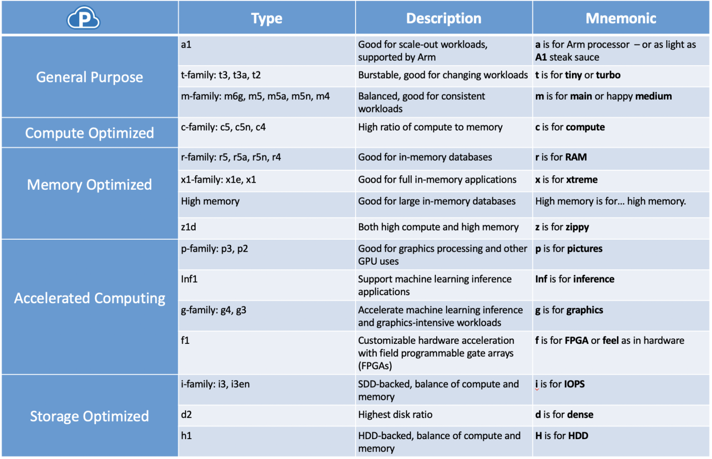

# Quick EC2 Instance Info

# General Purpose

## t instance type
The t3 family is a burstable instance type. If you have an application that needs to run with some basic CPU and memory usage, you can choose t3. It also works well if you have an application that gets used sometimes but not others. When the resource is idle, you’ll generate CPU credit, which you’ll utilize when the resource is used.

Make sure you also understand the difference between t3 and the older t2 – t3 are in “unlimited mode” by default, so instead of throttling down to baseline CPU when your instance runs out of credits, you pay for overages.

## m instance type
The m5 instance type is similar, but for more consistent workloads. It has a nice balance of CPU, memory, and disk. It’s not hard to see why almost half of EC2 workloads are on “m” instances. In addition to m5, you also have the option of m6g, which are powered by Arm-based AWS Graviton2 processors, making them more cost-efficient. There’s also m5a, m5n, and m4 – most of which are safe to ignore unless you have a specific use case for one of the other processors besides m5’s Intel Xeon Platinum 8175 processors. If you aren’t sure what to choose, m5 is the most versatile of all the Amazon instance types.

## a1 instance type
can be a less expensive option than other EC2. They are suited for scale-out workloads such as web servers, containerized microservices, caching fleets, distributed data stores, and development environments.  The instances are powered by Arm processors and suited for Arm-based workloads.

# Compute Optimized

## c instance type
The c5 instance type has a high ratio of compute/CPU versus memory. If you have a compute-intensive application – maybe scientific modelling, intensive machine learning, or multiplayer gaming – these instances are a good choice. There is also the c5d option, which is SSD-backed. See also the C5n which have up to 100 Gbps network bandwidth and increased memory compared to equivalent c5 instances. The c4 family is also still available.

# Memory Optimized

## r instance family
The r instance family is memory-optimized, which you might use for in-memory databases, real-time processing of unstructured big data, or Hadoop/Spark clusters. You can think of it as a kind of midpoint between the m5 and the x1e. In addition to r5, there are r5a which deliver lower cost per GiB memory and r5n which have higher bandwidth for applications that need improved network throughput and packet rate performance.

## x1 instance family
The x1 family has a much higher ratio of memory, so this is a good choice if you have a full in-memory application or a big data processing engine like Apache Spark or Presto. X1e are optimized for high-performance databases, in-memory databases, and other memory intensive enterprise applications.

## High Memory instance family
High memory instances run large in-memory databases, including production deployments of SAP HANA.

## z1d instance family
The z1d instances combine high compute capacity with a high memory footprint. They have a sustained core frequency of up to 4.0 GHz, the fastest of AWS’s offerings. These are best for electronic design automation (EDA) and some relational database workloads with high per-core licensing costs.

# Accelerated Computing

## p instance type
If you need GPUs on your instances, p3 instances are a good choice. They are useful for video editing, and AWS also lists use cases of “computational fluid dynamics, computational finance, seismic analysis, speech recognition, autonomous vehicles”

## Inf1 instance type
Specialized EC2 type for machine learning inference applications, such as recommendation engines, forecasting, image and video analysis, advanced text analytics, document analysis, voice, conversational agents, translation, transcription, and fraud detection.

## g instance type
Uses Graphics Processing Units (GPUs) to accelerate graphics-intensive workloads, and also designed to accelerate machine learning inference. This could include adding metadata to an image, automated speech recognition, and language translation, as well as graphics workstations, video transcoding, and game streaming in the cloud. 

## F1 instance type
Customizable hardware acceleration with field programmable gate arrays (FPGAs) – hence the “f”. Applications could include genomics research, financial analysis, and real-time video processing.

# Storage Optimize

## i3 instance type
similar to h1, but it is SSD backed, so if you need an NVMe drive, choose this type. Use it for NoSQL databases, in-memory databases, Elasticsearch, and more. The i3en option has higher network bandwidth with Elastic Network Adapter (ENA)-based enhanced networking. 

## d2 instance type
d2 instances have an even higher ratio of disk to CPU and memory, which makes them a good fit for Massively Parallel Processing (MPP), MapReduce and Hadoop distributed computing, and similar applications.

## h1 instance type
The h1 type is HDD backed, with a balance of compute and memory. You might use it for distributed file systems, network file systems, or data processing applications.

