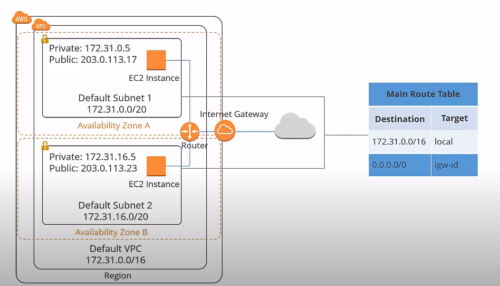
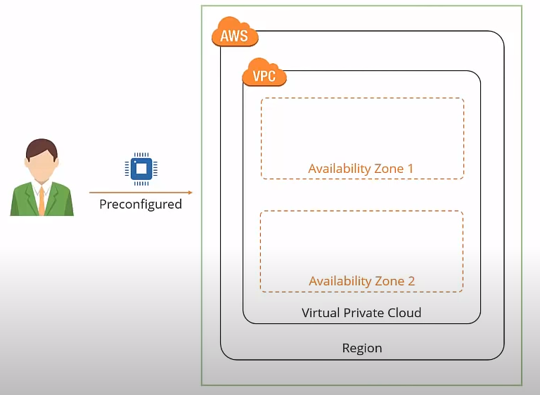
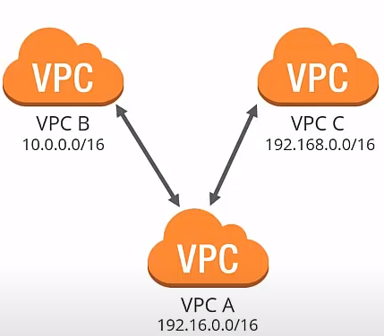
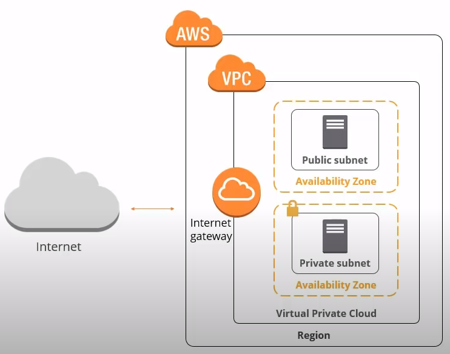
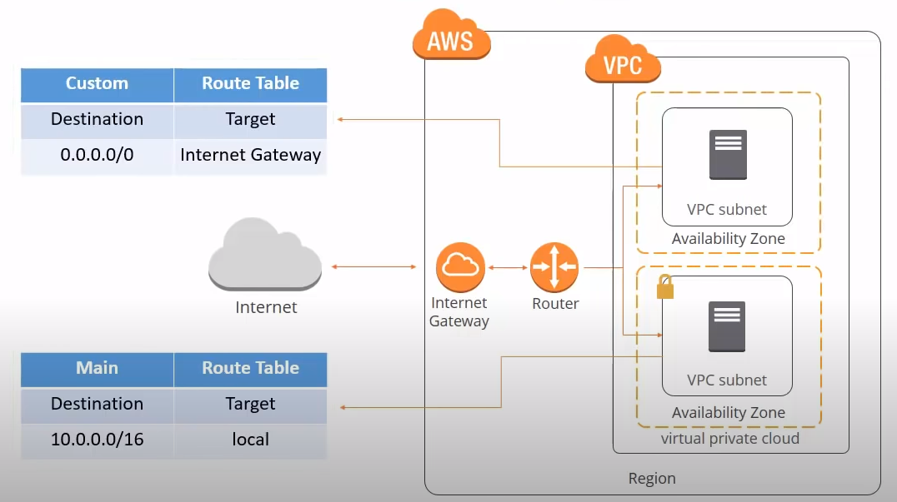
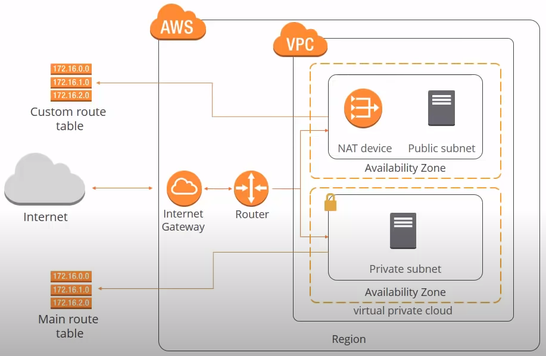
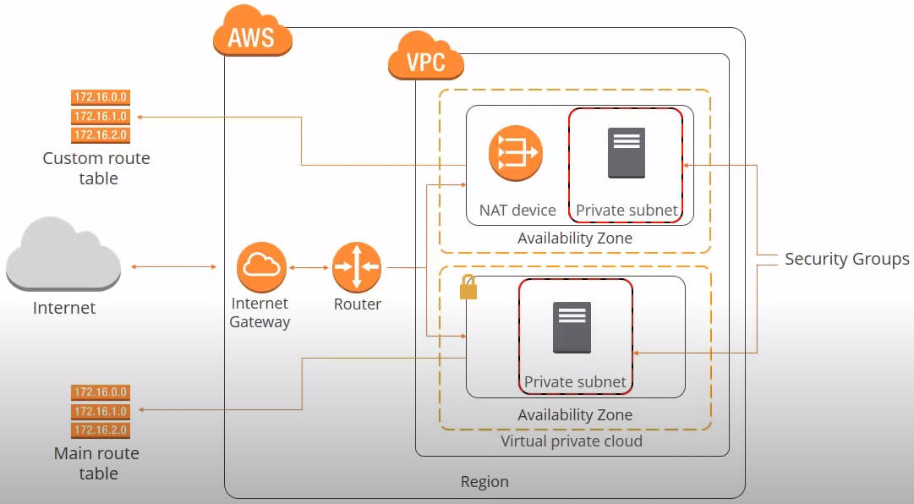
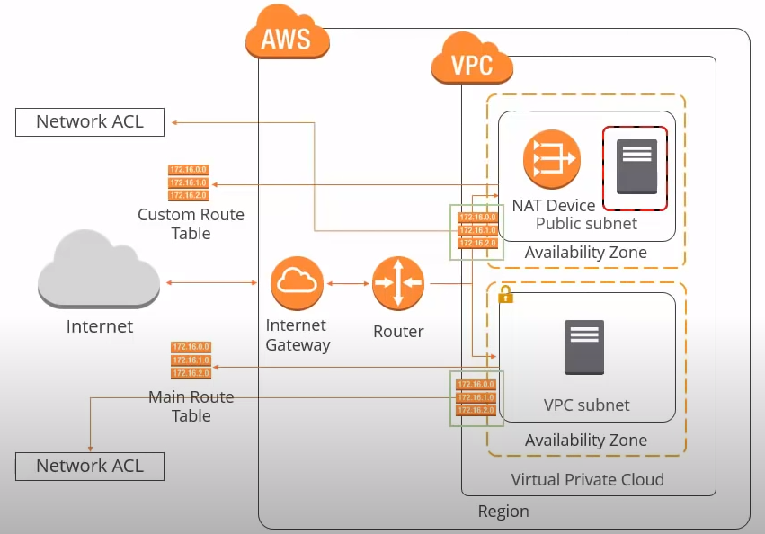
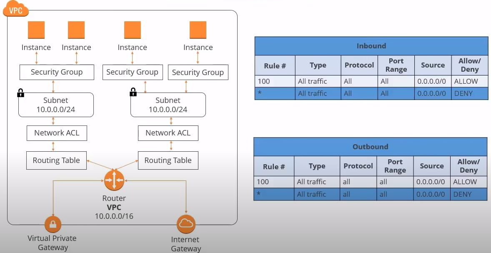

# Amazon VPC definition
Amazon Virtual Private Cloud (VPC) enables you to launch Amazon Web Services resources into a virtual network that you have defined. This virtual network closely resembles a traditional network that you would operate in your own datacenter, with the benefits of using the scalable infraestructure of AWS.

A VPC is your own virtual network in the Amazon cloud which is used as the network layer for your EC2 resources.

# Default AWS VPC
Each amazon account comes with a default VPC that is preconfigured for you to start straight away. You can launch your EC2 instances without having to think about anything. A VPC can span multiple AZ in a region.

# Custom VPC
Default VPC its great for launching new instances when you are testing, but creating a custom VPC allows you to make things more secure. You can customize your virtual network as you can define your own IP address range, you can create your own subnets that are both public and private and set new security settings.

# Hardware VPN Access
By default the instances that you launch into a VPC can't communicate with your own network. You can connect your VPC to your existing data center using Hardware VPN access, effectively extending your data center into the cloud and create a hybrid environment. To do this you need a Virtual Private Gateway and this is the VPN concentrator on the Amazon side of the VPN connection. Then in your datacenter side you need a customer gateway which is either a physical device or a software application.

# VPC peering
A peering connection can be made between your own VPCs or with a VPC in another AWS account as long as it is in the same region. Peering is a one to one relationship and a VPC can have multiple peering connections but transitive peering is not supported. VPCs with overlapping CIDRs (same IP ranges) cannot be paired. Thats to say B can connect with A but not with C. C can connect with A but not with B and A can connect with B and C.

If you delete the default VPC you have to contact AWS support to get it back again.

# Elastic IP address
This allows your instance to retain its public IP address. Elastic IP address is a static or persistent public IP address that is allocated to your account and can be associated to your instances as required. It remains in your account until you chose to release it. There is a charge associated with an elastic IP address if it is in your account but not actually associated to an instance.

# Subnet definition
A range of IP addresses in your VPC. You can launch AWS resources into a subnet that you select. Use a public subnet for resources that must be connected to the internet and a private subnet for resources that won't be connected to the internet.

The subnet is always mapped to a single AZ and you will not be able to launch any instance if you don't have subnets in you VPC. There is two types of subnet:
- Public: Resources connected to the internet (Web servers) It is public beacuse its main route table sends to subnets traffic that is destined for the internet to the internet gateway.
- Private: Resources that don't need an internet connection or that you want to protect from the internet (Databases).

# Internet Gateway definition
Its a horizontally scaled, redundant and highly available VPC component that allows communication between instances in your VPC and the internet. It therefore imposes no availability risks or bandwith constraints on your network traffic.

# Internet gateway requeriments
1. An internet gateway must be attached to your VPC.
2. All instances in your subnet must have either a public IP address or an Elastic IP address.
3. Your subnet's route table must point to the internet gateway.
4. All network access control and security groups rules must be configured to allow the required traffic to and from your instance.

# Route table definition
A route table contains a set of rules, called routes, which are used to determine where the network traffic is directed. A subnet must be asociated with one and one only route table.

Each VPC has a default route table and its a good practice to leave this in its original state and create a new route table to customize de network traffic routes associated with your VPC.

# NAT device
Enable instances in a private subnet to connect to the internet or AWS resources but prevent the internet from initiating connections with the instances in the private subnet. When traffic goes to the internet the source IP address of your instance is replaces with the NAT device addess and when the internet traffic comes back again the NAT device translates the address to your instances private IP address.

Aws provides two kind of NAT devices:
- NAT gateway: AWS recommended, it is a managed service that provides better availability and bandwith than NAT instances. Each NAT gateway is create in a specific availability zone and its implemented with redundancy in that zone. It must be launched in a public subnet because it needs internet conectivity, it needs an Elastic IP address. Once created you need to update the root table associated with your private subnet to point internet bound traffic to the NAT gateway. 
- NAT instance: It is launched from a NAT AMI running as an instance in your VPC.

# Security groups
A security group acts as a virtual firewall that controls the traffic for one or more instances. You add rules to each security group that allow traffic to or from its associated instances.

Examples:
- Security group for Web Server. Allow http and https ports from internet. All other traffic denied.
- Security group for Database. Allow MSSQL database connection port from internet, allow RDP from internal subnet, deny all other traffic.

# Security groups rules
- By default, security groups allow all outbound traffic.
- Security group rules are always permissive, that means you can't create a rule to deny access. That means you are allowing access rathen than denying it.
- Security groups are stateful. If you send a request from your instance the response traffic to that request is allowed to flow in regardless of the inbound security group rules.
- You can modify the rules of a security group at anytime and rules are applied inmidiately.

# Network ACL definition
A network access control list (ACL) is an optional layer of security for your VPC that acts as a firewall for controlling traffic in and out of one or more subnets. You might set up network ACLs with rules similar to your security groups in order to add an additional layer of security to your VPC.

A network ACL sits in between a root table and a subnet. The default network ACL is configured to allow all traffic to flow in and out of the subnets to which it is associated. Each NACL includes a rule whose rule number is an asterisk. This rule ensures that if a packet doesn't match any of the other numbered rules is denied. You cant modify or remove this rule.

# Network ACL rules
- Each subnet in your VPC must be associated with an ACL.
- A subnet can only be associated with one ACL. However, an ACL can be associated with multiple subnets.
- An ACL contains a list of numbered rules with are evaluated in order, starting with the lowest. As soon as a rule match its traffic it is applied regardless of any higher numbered rules that may contradict it.
- ACLs are stateless; responses to allowed inbound traffic are subject to the rules for outbound traffic.

# AWS best practices and costs
- Always use public and private subnets, you should use private subnets to secure resources that don't need to be available from the internet.
- To provide secure internet access to the instances that reside in your private subnets you should provide a NAT device.
- Choose your CIDR blocks carefully. Amazon VPC can contain from 16 to 65,536 IP addresses so you should chose your CIDR according to how many instances you will need.
- Create separate VPC for development, staging, test and production o create one VPC with separate subnets.
- You should use security groups and NACLs to secure the traffic coming in and out of your VPC. Amazon advises to use security groups for whitelisting traffic and NACLs to the blacklisting traffic
- Tiering security groups: You should create different security groups for different tiers of your infraestructure architecture inside VPC
- You should standarize your security group naming conventions. Following a security group naming convention allows Amazon VPC operation and management for large scale deployments to become much easier.
- Span VPC across multiple subnets in multiple AZs inside a region, this helps in architecting HA inside your VPC.

AWS has various limitations on the VPC components:
- 5 VPCs per region
- 200 subnets per VPC
- 200 route tables per VPC
- 500 security groups per VPC
- 50 inbound or outbound rules per VPC
> Some rules can be increased by raising a ticker with AWS support

AWS VPC costs:
- If you chose to create a hardware VPN connection to your VPC using Virtual Private Gateway you are charged for each VPN connection hour that your VPN connection is provisioned and available.
- Each partial VPN connection hour consumed is billed as full hour.
- You will also incur into AWS data transfer charges for all data transferred via the VPN connection.
- If you chose to create a NAT gateway in your VPC you are charged for each NAT gateway hour that your NAT gateway is provisioned and available. Data processing charges apply for each GB processed through that NAT gateway.
- Each partial NAT gateway hour consumed is billed as full hour.
