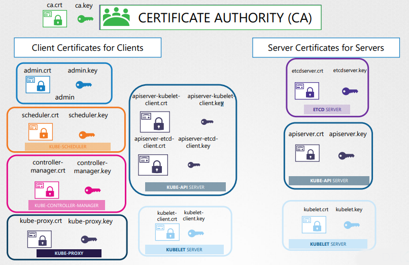

## Client / Server certificates
All connections inside the k8s cluster must be encrypted. Here there is a list of client and server certificates:


## Certificate Signing Request Object
`openssl genrsa -out test.key 2048`  
`openssl req -new -key test.key -subj "/CN=test" -out test.csr`  
```
test-csr.yaml
apiVersion: certificates.k8s.io/v1beta1
kind: CertificateSigningRequest
metadata:
  name: test
spec:
  groups:
  - system: authenticated
  usages:
  - digital signature
  - key encipherment
  - server auth
  request:
      (cat test.csr | base64 | tr -d"\n")
```
## Validate and extract csr object
`kubectl get csr`  
`kubectl certificate approve test`  

`kubectl get csr test -o yaml`  
`echo "cert content" | base64 --decode`  

> Certificate related operations are managed by the controller manager.

## Authenticate kubectl command
```
kubectl get pods
  --server my-kube-server:6443
  --client-key admin.key
  --client-certificate admin.crt
  --certificate-authority ca.crt
```
## KubeConfig file
```
.kube/config

apiVersion: v1
kind: Config
clusters:
- name: my-kube-server
  cluster:
    certificate-authority: /etc/kubernetes/pki/ca.crt
    # certificate-authority-data: use ca.crt content
    server: https://my-kube-server:6443
- name: development
  cluster:
    certificate-authority: /etc/kubernetes/pki/ca.crt
    server: https://my-kube-server-dev:6443

contexts:
- name: my-kube-amdin@my-kube-server
  context:
    cluster: my-kube-server
    user: my-kube-admin
- name: dev-user@development
  context:
    cluster: development
    user: dev-user
    namespace: devops

users:
- name: my-kube-admin
  user:
    client-certificate: /etc/kubernetes/pki/users/admin.crt
    client-key: /etc/kubernetes/pki/users/admin.key
- name: dev-user
  user:
    client-certificate: /etc/kubernetes/pki/users/dev-user.crt
    client-key: /etc/kubernetes/pki/users/dev-user.key
```

`kubectl config view`  
`kubectl config view --kubeconfig=my-config`  
`kubectl config use-context dev-user@development`  
